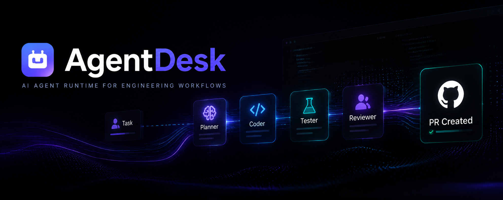
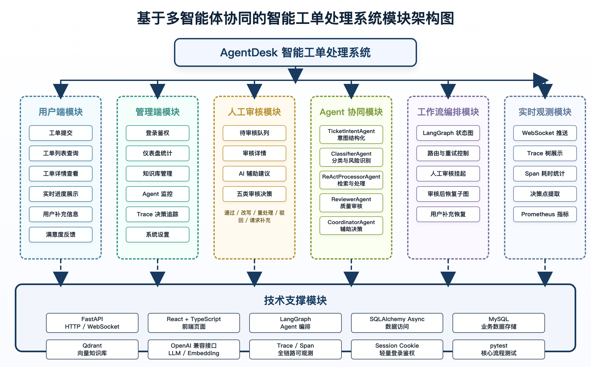
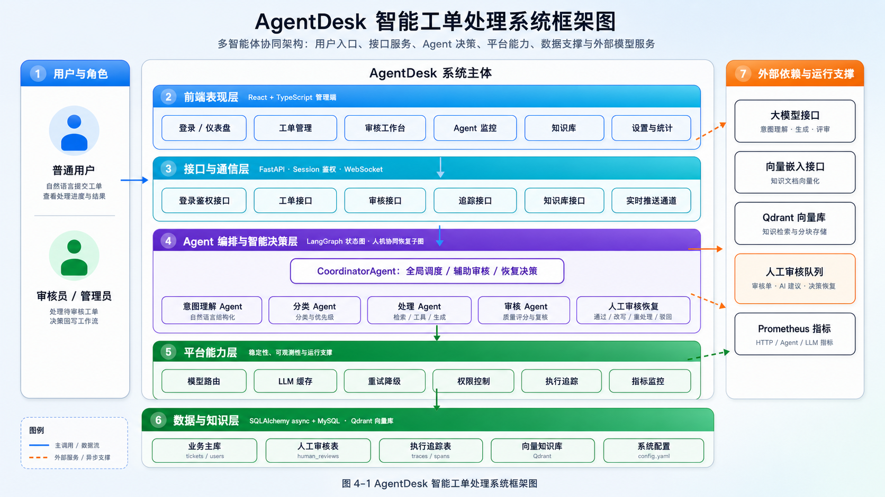
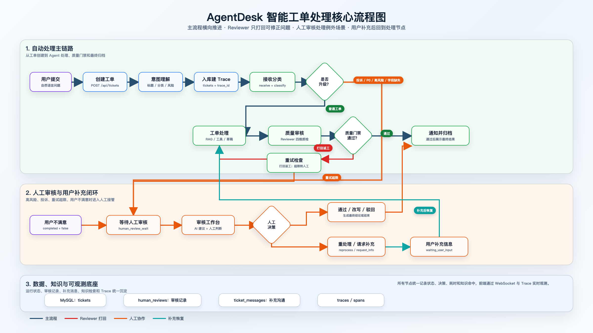

AgentDesk 是一个基于 LangGraph 的多智能体工单自动化系统。系统将自然语言工单转为结构化任务，并由 `TicketIntentAgent`、`ClassifierAgent`、`ReActProcessorAgent`、`ReviewerAgent`、`CoordinatorAgent` 协同完成意图理解、分类路由、知识库增强处理、质量审核、人工复核、用户补充恢复和执行追踪。

> 设计文档已按最新代码和数据库实现同步到 v1.3。答辩或汇报优先阅读：[设计规范总览](docs/design-spec/README.md) · [总体架构](docs/design-spec/00_预设计/02_系统功能与总体架构.md) · [核心流程](docs/design-spec/01_正式设计/02_工单处理流程设计.md) · [数据存储](docs/design-spec/01_正式设计/05_数据存储设计.md) · [接口协议](docs/design-spec/03_接口协议/01_HTTP_API接口协议.md)

## 核心特性

- **LangGraph 状态机编排**：工单生命周期 `receive → classify → route → process → review → notify → complete`
- **五类 Agent 协同**：意图理解 / 分类路由 / RAG 增强处理 / 质量审核 / 人工审核辅助
- **人工审核工作台**：AI 不确定时挂起工单，审核员五类决策（通过 / 改写 / 重处理 / 驳回 / 请求补充），CoordinatorAgent 提供辅助建议
- **用户补充恢复闭环**：审核员可请求订单号、支付流水等关键信息，用户补充后写入 `ticket_messages` 并从 `process` 节点恢复处理
- **智能降级**：LLM 失败自动降级到关键词匹配 / 默认策略；RAG embedding 异常时改用关键词检索
- **模型路由 + LLM 缓存**：按任务类型选模型，LRU + TTL 缓存降低重复 Token 消耗
- **Prometheus 监控**：HTTP / Agent / LLM / 缓存全链路指标，Grafana 可视化
- **分布式追踪 + 决策链**：Span 树记录 Agent 轨迹、LLM 输入输出、工具调用、Token 用量、关键决策点
- **WebSocket 实时推送**：工单状态 / 审核队列实时同步前端
- **MySQL + Qdrant 数据底座**：MySQL 存储核心业务与 trace 数据，Qdrant 提供知识库向量检索

## 系统架构



上图从功能分解角度展示系统模块：用户端、管理端、人工审核、Agent 协同、工作流编排、实时观测和底部技术支撑。它适合在论文和答辩中说明系统由哪些模块组成。



上图展示静态系统架构：前端应用、FastAPI 接口层、LangGraph 编排层、Agent 智能决策层、平台能力层、MySQL/Qdrant 数据层和外部模型服务的关系。更细的调用链路与流程图见 [系统功能与总体架构](docs/design-spec/00_预设计/02_系统功能与总体架构.md)。



上图展示端到端业务流转：工单创建、意图结构化、分类路由、ReAct 处理、质量审核、人工审核、用户补充、工作流恢复和结果归档。模块架构图回答“系统由什么组成”，流程图回答“工单如何流转”。

## 项目结构

```
src/multi_agent_system/
├── api/              # FastAPI REST API + WebSocket
├── agents/           # Agent 实现（意图/分类/处理/审核/协调）
├── core/             # 基础设施（数据库/鉴权/重试/缓存/指标/追踪）
├── models/           # Pydantic 数据模型
├── tools/            # 外部工具（数据库/向量检索/通知）
├── workflow/         # LangGraph 状态机编排
└── config.py         # 全局配置
```

配套前端位于 `web/`，设计文档位于 `docs/design-spec/`。

## 快速开始

### 环境要求

- Python 3.10+
- Node.js 18+
- Docker + Docker Compose（可选，用于 Qdrant + Grafana + Prometheus）
- MySQL 8.0+（业务主库）
- OpenAI 兼容 API Key

### 本地开发

```bash
# 1. 克隆项目
git clone https://github.com/ArtLjn/ai-agent-learning
cd ai-agent-learning

# 2. 创建虚拟环境
python -m venv venv
source venv/bin/activate  # Windows: venv\Scripts\activate

# 3. 安装依赖
pip install -r requirements.txt

# 4. 配置项目参数
cp config.yaml.example config.yaml
# 编辑 config.yaml，填写 LLM、Embedding、MySQL、Qdrant、登录密钥等

# 5. 启动后端
uvicorn src.multi_agent_system.api.app:app --host 0.0.0.0 --port 9001 --reload

# 6. 启动前端（新终端）
cd web && npm install && npm run dev
```

### Docker 一键部署

```bash
bash scripts/deploy-docker.sh
```

服务地址：

| 服务 | 地址 |
|------|------|
| 前端 | http://localhost:5173 |
| 本地 API | http://localhost:9001 |
| 本地 API 文档 | http://localhost:9001/docs |
| Docker API | http://localhost:8001 |
| Docker API 文档 | http://localhost:8001/docs |
| Grafana | http://localhost:3000 |
| Prometheus | http://localhost:9090 |

## 功能亮点

### 前端页面

面向演示与运维的管理端，覆盖工单处理闭环：

- **Dashboard** — 工单总览、成功率、平均耗时、待处理风险、审核压力、近期工单
- **工单管理** — 结构化提交、筛选搜索、分页浏览、详情页
- **工单详情** — 工单内容、处理结果、知识库参考、用户补充记录、Agent 消息链、执行决策链
- **审核工作台** — 处理待审核工单，查看 AI 辅助建议，必要时请求用户补充
- **Agent 监控** — trace 列表、Span 时间线、节点 IO、RAG 命中、Token 用量、决策点
- **知识库** — 文档上传、Qdrant 分块查看、按标题/分类/内容检索

### 人工审核工作台

当 Agent 自主处理不够确定时（投诉类工单、AI 审核失败 3 次、工作流异常、用户主动反馈不满意、业务操作缺少关键字段），工单自动挂起进入审核队列：

- **审核入口** — 侧边栏"审核工作台"，按触发类型 / 分类 / 优先级筛选
- **AI 辅助** — CoordinatorAgent 给出推荐决策 + 置信度 + 关注点
- **五类决策** — 通过（沿用 AI 结果）/ 改写（覆盖结果）/ 重处理（清空 retry 重跑）/ 驳回 / 请求补充
- **补充闭环** — `request_info` 后工单进入 `waiting_user_input`，用户消息写入 `ticket_messages`，系统携带 `conversation_context` 恢复处理
- **WebSocket 推送** — 新工单进入队列时即时刷新
- **指标追踪** — AI 建议采纳率（ai_adoption_rate）、平均决策时长

## 决策链与 RAG 追踪

系统在关键节点写入结构化 trace，用于解释 Agent 为什么这样处理：

| 决策点 | 记录内容 |
|--------|---------|
| 分类决策 | 候选分类、选中分类、置信度、理由 |
| 审核决策 | 审核分数、阈值、通过或重试选择 |
| 重试边界 | retry 与人工升级之间的阈值判断 |
| 用户补充 | request_info、ticket_messages、conversation_context、恢复节点 |
| LLM 调用 | 模型、任务类型、消息摘要、输出、finish_reason、Token 用量 |
| 知识库检索 | query、top_k、命中文档、最高相似度、分块预览 |

前端可通过工单详情页或 Agent 监控页查看，后端也提供独立接口：

```bash
# 查询某 trace 的所有决策点
curl http://localhost:9001/api/traces/{trace_id}/decisions
```

## 技术栈

| 类别 | 技术 |
|------|------|
| LLM 接口 | OpenAI SDK（兼容 Ollama / DeepSeek 等） |
| 工作流编排 | LangGraph |
| API 框架 | FastAPI + Uvicorn |
| 前端 | React 19 + TypeScript + TailwindCSS + shadcn/ui |
| 数据校验 | Pydantic |
| 业务数据库 | MySQL + SQLAlchemy 2.0 async + aiomysql |
| 向量数据库 | Qdrant |
| 登录鉴权 | Starlette Session + bcrypt |
| 监控 | Prometheus + Grafana |
| 日志 | loguru |
| 容器化 | Docker + Docker Compose |

## 项目文档

- [项目架构导读](docs/project-guide.md) — 完整架构说明与代码阅读指南
- [多智能体系统设计](docs/multi-agent-system-guide.md) — Agent 协同与决策机制
- [设计规范总览](docs/design-spec/README.md) — v1.3 设计文档入口
- [系统功能与总体架构](docs/design-spec/00_预设计/02_系统功能与总体架构.md) — 模块架构图、总体架构图、流程图和分层说明
- [多智能体协同架构](docs/design-spec/01_正式设计/01_多智能体协同架构.md) — Agent 职责边界与协作关系
- [工单处理流程设计](docs/design-spec/01_正式设计/02_工单处理流程设计.md) — 自动处理、重试、人工审核恢复流程
- [数据存储设计](docs/design-spec/01_正式设计/05_数据存储设计.md) — MySQL 表结构与核心数据关系
- [HTTP API 接口协议](docs/design-spec/03_接口协议/01_HTTP_API接口协议.md) — 前后端接口契约
- [WebSocket 实时推送协议](docs/design-spec/03_接口协议/02_WebSocket实时推送协议.md) — 工单状态和审核事件推送

## License

MIT
