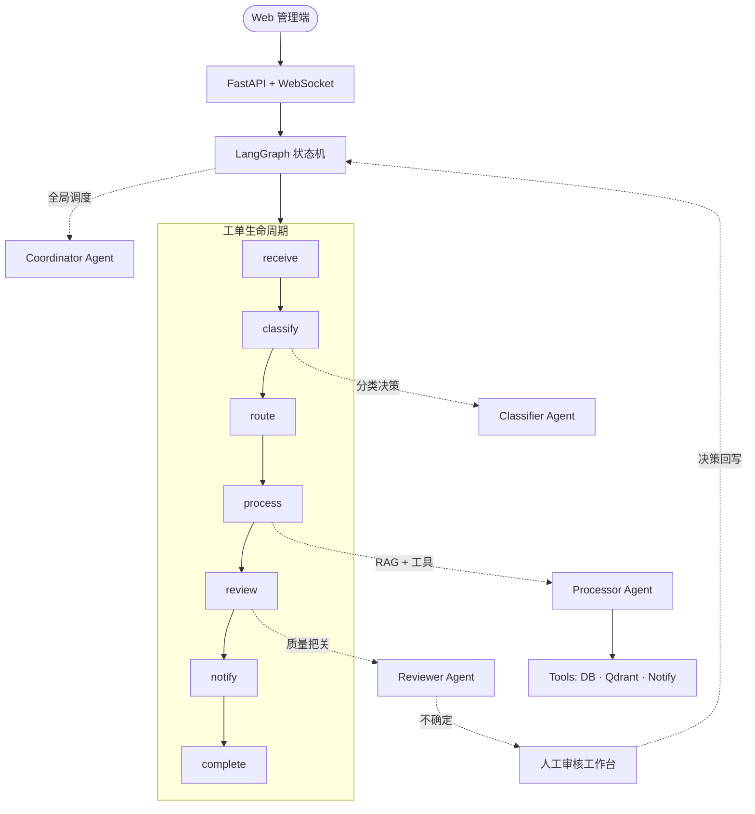

# AgentDesk — 基于多智能体协同的工单处理系统


AgentDesk 是一个基于 LangGraph 多智能体协同的企业级工单自动化处理系统。通过分类、处理、审核、协调四个 Agent 的协作，实现工单从接收到完成的全生命周期自动化管理。

## 核心特性

- **LangGraph 状态机编排**：工单生命周期 `receive → classify → route → process → review → notify → complete`
- **四 Agent 协同**：分类（智能路由）/ 处理（RAG 增强）/ 审核（质量把关）/ 协调（全局调度）
- **人工审核工作台**：AI 不确定时挂起工单，审核员四选一决策（通过 / 改写 / 重处理 / 驳回），CoordinatorAgent 提供辅助建议
- **智能降级**：LLM 失败自动降级到关键词匹配 / 默认策略；RAG embedding 异常时改用关键词检索
- **模型路由 + LLM 缓存**：按任务类型选模型，LRU + TTL 缓存降低重复 Token 消耗
- **Prometheus 监控**：HTTP / Agent / LLM / 缓存全链路指标，Grafana 可视化
- **分布式追踪 + 决策链**：Span 树记录 Agent 轨迹、LLM 输入输出、工具调用、Token 用量、关键决策点
- **WebSocket 实时推送**：工单状态 / 审核队列实时同步前端
- **Qdrant 知识库**：向量检索增强处理能力，工单参考可跳转回原文核对

## 系统架构



## 项目结构

```
src/multi_agent_system/
├── api/              # FastAPI REST API + WebSocket
├── agents/           # 四大 Agent（分类/处理/审核/协调）
├── core/             # 基础设施（重试/降级/缓存/指标/路由/追踪）
├── models/           # Pydantic 数据模型
├── tools/            # 外部工具（数据库/向量检索/通知）
├── workflow/         # LangGraph 状态机编排
└── config.py         # 全局配置
```

## 快速开始

### 环境要求

- Python 3.10+
- Node.js 18+
- Docker + Docker Compose（可选，用于 Qdrant + Grafana + Prometheus）
- OpenAI 兼容 API Key

### 本地开发

```bash
# 1. 克隆项目
git clone https://github.com/ArtLjn/ai-agent-learning
cd ai-agent-learning

# 2. 创建虚拟环境
python -m venv venv
source venv/bin/activate  # Windows: venv\Scripts\activate

# 3. 安装依赖
pip install -r requirements.txt

# 4. 配置环境变量
cp .env.example .env
# 编辑 .env，填写 LLM_BASE_URL、LLM_API_KEY 等

# 5. 启动后端
uvicorn src.multi_agent_system.api.app:app --reload

# 6. 启动前端（新终端）
cd web && npm install && npm run dev
```

### Docker 一键部署

```bash
bash scripts/deploy-docker.sh
```

服务地址：

| 服务 | 地址 |
|------|------|
| 前端 | http://localhost:5173 |
| API | http://localhost:8000 |
| API 文档 | http://localhost:8000/docs |
| Grafana | http://localhost:3000 |
| Prometheus | http://localhost:9090 |

## 功能亮点

### 前端页面

面向演示与运维的管理端，覆盖工单处理闭环：

- **Dashboard** — 工单总览、成功率、平均耗时、待处理风险、审核压力、近期工单
- **工单管理** — 结构化提交、筛选搜索、分页浏览、详情页
- **工单详情** — 工单内容、处理结果、知识库参考、Agent 消息链、执行决策链
- **审核工作台** — 处理待审核工单，查看 AI 辅助建议
- **Agent 监控** — trace 列表、Span 时间线、节点 IO、RAG 命中、Token 用量、决策点
- **知识库** — 文档上传、Qdrant 分块查看、按标题/分类/内容检索

### 人工审核工作台

当 Agent 自主处理不够确定时（投诉类工单、AI 审核失败 3 次、工作流异常、用户主动反馈不满意），工单自动挂起进入审核队列：

- **审核入口** — 侧边栏"审核工作台"，按触发类型 / 分类 / 优先级筛选
- **AI 辅助** — CoordinatorAgent 给出推荐决策 + 置信度 + 关注点
- **四种决策** — 通过（沿用 AI 结果）/ 改写（覆盖结果）/ 重处理（清空 retry 重跑）/ 驳回
- **WebSocket 推送** — 新工单进入队列时即时刷新
- **指标追踪** — AI 建议采纳率（ai_adoption_rate）、平均决策时长

## 决策链与 RAG 追踪

系统在关键节点写入结构化 trace，用于解释 Agent 为什么这样处理：

| 决策点 | 记录内容 |
|--------|---------|
| 分类决策 | 候选分类、选中分类、置信度、理由 |
| 审核决策 | 审核分数、阈值、通过或重试选择 |
| 重试边界 | retry 与人工升级之间的阈值判断 |
| LLM 调用 | 模型、任务类型、消息摘要、输出、finish_reason、Token 用量 |
| 知识库检索 | query、top_k、命中文档、最高相似度、分块预览 |

前端可通过工单详情页或 Agent 监控页查看，后端也提供独立接口：

```bash
# 查询某 trace 的所有决策点
curl http://localhost:8000/api/traces/{trace_id}/decisions
```

## 技术栈

| 类别 | 技术 |
|------|------|
| LLM 接口 | OpenAI SDK（兼容 Ollama / DeepSeek 等） |
| 工作流编排 | LangGraph |
| API 框架 | FastAPI + Uvicorn |
| 前端 | React 19 + TypeScript + TailwindCSS + shadcn/ui |
| 数据校验 | Pydantic |
| 向量数据库 | Qdrant |
| 监控 | Prometheus + Grafana |
| 日志 | loguru |
| 容器化 | Docker + Docker Compose |

## 项目文档

- [项目架构导读](docs/project-guide.md) — 完整架构说明与代码阅读指南
- [多智能体系统设计](docs/multi-agent-system-guide.md) — Agent 协同与决策机制
- [Agent 监控与决策追踪](docs/design-spec/) — trace 系统设计文档合集

## License

MIT
