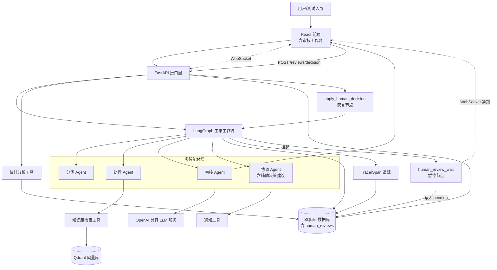
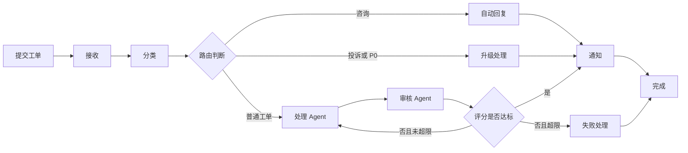

# 系统功能与总体架构

## 1. 功能概览

系统围绕“工单自动处理”展开，主要包含以下功能模块：

| 模块 | 主要功能 | 对应源码 |
| --- | --- | --- |
| 工单管理 | 提交工单、批量提交、列表查询、详情查询、反馈提交 | `api/routes.py`、`models/ticket.py` |
| 多 Agent 工作流 | 接收、分类、路由、处理、审核、通知、完成、失败处理、人工审核挂起/恢复 | `workflow/graph.py` |
| 知识库管理 | 上传知识文档、分块、向量检索 | `tools/knowledge_search.py` |
| 执行追踪 | trace/span 记录、节点耗时统计、执行树查询、human_decision span | `core/trace.py`、`core/database.py` |
| 统计分析 | 分类分布、优先级分布、处理成功率、满意度 | `tools/analytics.py`、`core/evaluation.py` |
| 人工审核 | 审核队列、审核详情、决策提交、审核统计、辅助决策建议 | `api/routes.py`、`agents/coordinator.py` |
| 前端展示 | 仪表盘、工单列表、详情、知识库、Agent 监控、设置、审核工作台 | `web/src/pages/` |

## 2. 总体架构

### 2.1 架构演进说明

相比 v0.1 版本，本次升级引入"人机协同"维度，把原先仅写入文字消息的"假升级"改为真实的人工审核闭环。详细设计见 [09_人工审核工作台设计.md](../01_正式设计/09_人工审核工作台设计.md)。

## 3. 分层说明

### 3.1 表现层

表现层由 React 前端组成，提供工单创建、工单列表、详情查看、知识库上传、运行监控和系统设置等页面。前端通过 HTTP API 获取数据，通过 WebSocket 接收实时状态更新。

### 3.2 接口层

接口层由 FastAPI 实现，负责请求参数校验、路由分发、工作流触发和结果查询。工单提交接口采用后台异步执行模式，提交后立即返回 `ticket_id`，实际处理由后台任务继续执行。

### 3.3 编排层

编排层由 LangGraph 状态图实现。系统将工单生命周期拆成多个节点，并通过条件边控制路由方向，例如咨询类自动回复、投诉类升级、高优先级工单升级、普通工单进入处理和审核流程。

### 3.4 智能体层

智能体层由分类、处理、审核、协调四类 Agent 组成。每个 Agent 只负责一个主要职责，降低单个 Agent 的提示词复杂度，也便于论文中解释协同机制。

### 3.5 工具与数据层

工具层包括数据库查询、知识库检索、通知、统计分析等能力。数据层使用 SQLite 存储核心业务数据，使用 Qdrant 存储知识库向量数据。

## 4. 核心流程

## 5. 架构特点

- 职责清晰：接口、编排、Agent、工具、数据层边界明确。
- 流程可解释：每个工作流节点都可以被追踪和展示。
- 可降级运行：LLM 或知识库不可用时，系统保留关键词规则和占位处理能力。
- 易于演示：前后端和测试用例能覆盖主要业务闭环。
- 体量适中：保留多智能体和 RAG 亮点，不引入过重的企业级业务。

