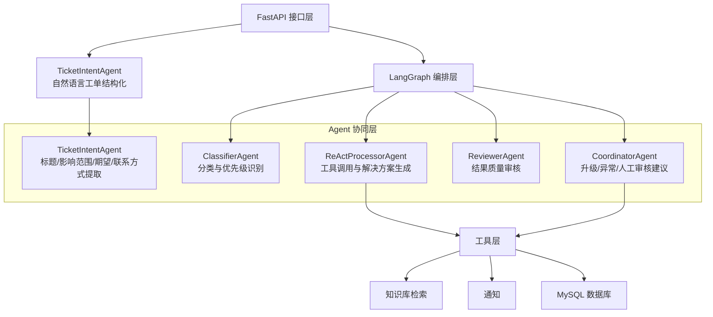
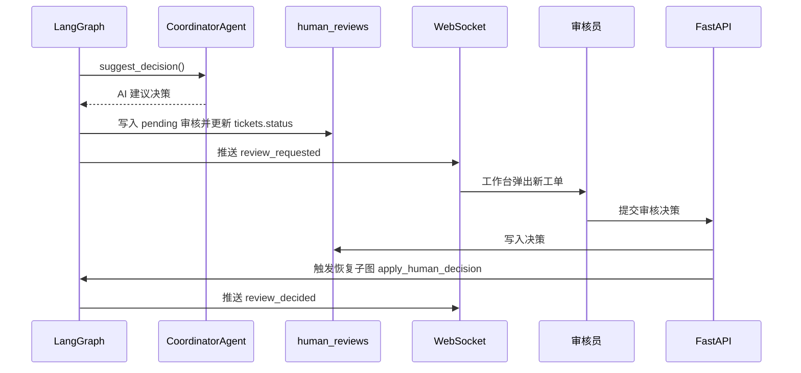

# 多智能体协同架构

## 1. 设计目标

多智能体协同架构的目标是将工单处理过程拆分为多个职责明确、可独立理解和测试的 Agent。每个 Agent 只负责流程中的一个环节，通过 FastAPI 入口和 LangGraph 状态机传递共享状态，最终形成自动处理、质量审核、人工复核和执行追踪的完整闭环。

## 2. Agent 分层结构

## 3. 协同方式

系统采用“共享状态 + 条件路由”的协同方式：

- 工单入口先由 `TicketIntentAgent` 将用户原始描述格式化，提取标题、分类、优先级、影响范围、联系方式等字段，并写入初始工单。
- 共享状态由 `TicketState` 表示，包含工单 ID、内容、分类、优先级、处理结果、知识引用、审核评分、重试次数、状态、消息链、用户上下文、trace ID 和人工审核标记等字段。
- 每个节点读取当前状态，产出局部更新。
- LangGraph 将节点输出合并到全局状态中。
- 条件路由函数根据分类、优先级、审核评分和重试次数决定下一步。

这种方式避免 Agent 之间直接互相调用，降低耦合度，也方便追踪每个 Agent 的独立贡献。

## 4. 架构职责划分

| 层级 | 职责 | 主要文件 |
| --- | --- | --- |
| API 层 | 登录鉴权、接收请求、触发工作流、查询结果、推送状态 | `api/app.py`、`api/routes.py`、`api/auth_routes.py` |
| 编排层 | 定义状态节点、条件边和整体生命周期 | `workflow/graph.py` |
| Agent 层 | 执行分类、处理、审核和协调任务 | `agents/*.py` |
| 工具层 | 提供知识检索、数据库、通知、统计工具 | `tools/*.py` |
| 基础设施层 | 提供缓存、重试、降级、追踪、指标等能力 | `core/*.py` |
| 数据层 | 存储工单、用户、检查点、模式库、trace、span、人工审核 | `models/db.py`、`core/database.py` |

## 5. 关键设计点

### 5.1 Agent 注入

`build_ticket_graph()` 支持传入 Agent 实例。如果未传入 Agent，工作流可以退回到占位逻辑。这种设计便于测试，也使系统在 LLM 不可用时仍能演示基本流程。

`TicketIntentAgent` 不属于 LangGraph 内部节点，而是在创建工单接口中执行。这样可以在工作流启动前完成自然语言清洗和结构化，保证后续 `TicketState.content` 已经包含问题标题、紧急程度、影响范围、原始描述等信息。

### 5.2 降级与容错

Agent 内部结合重试和降级策略。意图理解和分类失败时可通过关键词规则兜底；知识库不可用时处理 Agent 仍可直接生成或返回基础处理结果；通知工具当前以模拟记录为主，不依赖真实外部渠道。工作流异常时优先转入 `error_fallback` 人工审核，若人工审核兜底也失败，才最终标记为 `failed`。

### 5.3 执行追踪

每个关键节点可以创建 span，记录输入、输出、耗时和状态。前端可通过 trace 接口查看执行树，使多 Agent 协作过程具备可解释性。

## 6. 本科毕设取舍

本项目没有采用复杂的全自治 Agent 群聊模式，也没有引入任务拍卖、长期规划或多 Agent 自我反思循环。原因是工单处理流程本身具有明确步骤，使用状态机编排更稳定、更容易测试，也更适合本科毕设按章节说明和答辩演示。

## 7. 人机协同维度（v1.0 新增）

系统在纯 Agent 协同之外，引入"人工审核员"作为人机协同参与者。原有 Agent 之间通过共享状态协同，而 Agent 与人通过持久化的 `human_reviews` 表、WebSocket 事件和恢复子图协同。详细设计见 [09_人工审核工作台设计.md](./09_人工审核工作台设计.md)。

### 7.1 协同方式

### 7.2 CoordinatorAgent 职责扩展

CoordinatorAgent 除了原有的 escalate 摘要、失败分析、报告生成外，新增 `suggest_decision` 方法，用于在工单挂起时生成辅助决策建议。建议与最终人工决策的对比构成 `ai_adoption_rate` 指标，是论文的重要评估数据。

### 7.3 与纯 Agent 协同的区别

| 维度 | Agent ↔ Agent | Agent ↔ 人 |
| --- | --- | --- |
| 通信方式 | 共享状态（TicketState） | 持久化表 + WebSocket + 恢复子图 |
| 同步性 | 同步函数调用 | 异步暂停 / 恢复 |
| 决策耗时 | 毫秒到秒级 | 分钟到小时级 |
| 错误恢复 | 重试 / 降级 | 等待 / 重新分配（展望） |
| 可解释性 | trace + span | trace 中新增 human_decision span |
