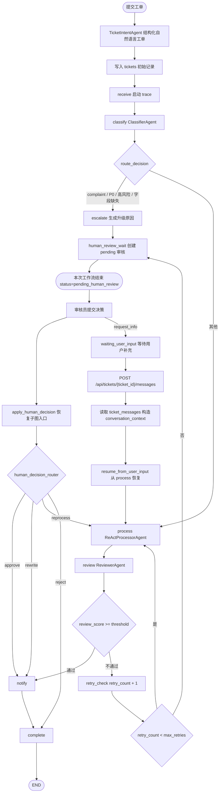

# 工单处理流程设计

## 1. 流程目标

工单处理流程需要完成从“用户提交问题”到“系统给出处理结果”的闭环。流程设计应满足以下要求：

- 能根据工单内容自动分类和识别优先级。
- 能在创建工单时先理解用户自然语言描述，生成结构化工单正文。
- 能对不同类型工单走不同处理路径。
- 能对普通工单生成解决方案并审核质量。
- 能对低质量结果进行有限次数重试，并在超限后转入人工审核。
- 能在人工审核后根据审核员决策恢复自动流程。
- 能在人工审核发现缺少关键信息时暂停工单，等待用户补充后继续自动处理。
- 能记录状态变化并实时推送给前端。

## 2. 状态节点

| 节点 | 职责 | 典型状态 |
| --- | --- | --- |
| `create_ticket` | HTTP 入口，调用 TicketIntentAgent 并保存初始工单 | `received` |
| `receive` | 接收工单，初始化上下文和 trace | `received` |
| `classify` | 识别分类和优先级 | `classifying` |
| `route` | 根据分类和优先级选择路径 | 不修改状态 |
| `auto_reply` | 预留的自动回复节点，当前主路由未使用 | `processing` |
| `escalate` | 对投诉或高优先级工单进行升级 | `processing` |
| `process` | 生成普通工单解决方案 | `processing` |
| `review` | 审核处理结果质量 | `reviewing` |
| `retry_check` | 检查是否继续重试 | `processing` 或 `failed` |
| `handle_failure` | 处理最终失败场景 | `failed` |
| `human_review_wait` | 挂起工单等待人工审核（v1.0 新增） | `pending_human_review` |
| `apply_human_decision` | 接收人工决策并恢复工作流（v1.0 新增） | `processing` / `reviewing` |
| `pause_for_user_input` | 审核员请求用户补充信息，关闭当前审核单并暂停工单（v1.3 新增） | `waiting_user_input` |
| `resume_from_user_input` | 用户提交补充消息后，从 `process` 节点恢复处理（v1.3 新增） | `processing` |
| `notify` | 推送处理结果 | `completed` 前置 |
| `complete` | 完成归档 | `completed` |

## 3. 状态流转图

注：`human_review_wait` 之后工作流本次执行结束；审核员提交 `approve` / `rewrite` / `reprocess` / `reject` 决策后由 API 触发新的工作流执行，从 `apply_human_decision` 节点开始。若审核员提交 `request_info`，系统不立即恢复工作流，而是进入 `waiting_user_input`；用户补充消息后再由 `resume_from_user_input` 启动用户补充恢复子图。

## 4. 路由规则

| 条件 | 下一节点 | 设计原因 |
| --- | --- | --- |
| 分类为 `complaint` | `escalate` | 投诉类问题需要更谨慎，进入人工审核前置处理 |
| 优先级为 `P0` | `escalate` | 紧急问题不直接自动闭环 |
| `requires_human_review=true` | `escalate` | 风险策略判断需要人工复核 |
| `requires_business_operation=true` 且缺少 `required_fields` | `escalate` | 退款、扣费核查等业务操作缺少订单号或支付凭证时不能直接闭环 |
| 其他普通问题 | `process` | 进入处理和审核流程 |

## 5. 审核与重试

审核 Agent 输出 `review_score`。当前阈值由配置项 `review_threshold` 控制，默认值为 `0.7`。

- `review_score >= 0.7`：进入通知和完成流程。
- `review_score < 0.7` 且重试次数未超限：返回处理节点重新生成方案。
- 重试次数达到上限：进入 `human_review_wait`，等待审核员决策。

这种设计体现了“生成后校验 + 人工兜底”的思想，也能在论文中说明系统如何降低低质量输出直接返回给用户的风险。

## 6. 用户二次补充流程

用户二次补充用于处理“工单需要业务操作，但缺少必要信息”的场景，例如退款核查缺少订单号、重复扣费缺少支付流水号、投诉处理缺少联系方式等。该流程由人工审核员发起，但后续恢复仍由 Agent 自动执行。

### 6.1 触发条件

| 来源 | 触发动作 | 结果 |
| --- | --- | --- |
| CoordinatorAgent 辅助建议 | `recommended_decision=request_info` | 审核员可直接采纳建议 |
| 审核员人工判断 | 在审核工作台点击“请求补充” | 提交 `decision=request_info` |
| 风险策略前置判断 | 工单缺少业务处理关键字段 | 更容易进入人工审核，等待审核员确认是否请求补充 |

### 6.2 状态与数据写入

1. 审核员提交 `POST /api/reviews/{ticket_id}/decision`，其中 `decision=request_info`，`decision_reason` 为希望用户补充的说明。
2. 后端调用 `pause_for_user_input()`：
   - 更新当前 `human_reviews` 记录：`decision=request_info`、`status=decided`；
   - 更新 `tickets.status=waiting_user_input`；
   - 写入一条 `ticket_messages`，`sender_type=reviewer`，`metadata.source=request_info`；
   - 记录 `user_input_requested` span；
   - 推送 `user_input_requested` 和普通 `ticket_update`。
3. 工单详情页在 `waiting_user_input` 状态下展示补充输入框。

### 6.3 恢复处理

1. 用户提交 `POST /api/tickets/{ticket_id}/messages`，请求体包含 `content` 和可选 `sender_id`。
2. 后端校验工单必须处于 `waiting_user_input`，否则返回 409。
3. 用户消息写入 `ticket_messages`，`sender_type=user`。
4. `resume_from_user_input()` 读取该工单最近 20 条沟通记录，构造 `conversation_context`。
5. 恢复子图从 `process` 开始执行，处理 Agent 会把原始工单和补充信息一起作为输入。
6. 后续仍走 `review → notify/complete` 或 `review → retry_check → human_review_wait`。

### 6.4 设计收益

- 避免 AI 在缺少订单号、支付流水等关键信息时编造处理结果。
- 让人工审核从“最终处理者”变成“信息质量把关者”，保留 Agent 自动闭环能力。
- `ticket_messages` 保存完整沟通上下文，便于前端展示、trace 分析和论文复盘。

## 7. 实时更新机制

工单提交后，后端通过 `asyncio.create_task()` 后台执行工作流。每个节点完成后，系统会：

- 合并当前节点输出到工单状态。
- 将最新状态写入数据库。
- 构造 WebSocket 消息。
- 推送给单工单订阅连接和全局监控连接。
- 当进入 `waiting_user_input` 时，额外推送 `user_input_requested` 审核事件，提醒前端刷新审核队列和工单详情。

前端因此可以在详情页或监控页展示实时进度。

## 8. 异常处理

当工作流执行异常时，系统会捕获异常并执行以下动作：

- 将工单状态写为 `failed`。
- 保存错误信息。
- 通过 WebSocket 推送失败消息。
- 在日志中记录异常，便于定位问题。

当前代码的异常兜底优先级更细：工作流后台任务异常时，系统会先尝试创建 `error_fallback` 类型人工审核单并把工单置为 `pending_human_review`；只有人工审核兜底也失败时，才会进入最终 `failed` 状态。
