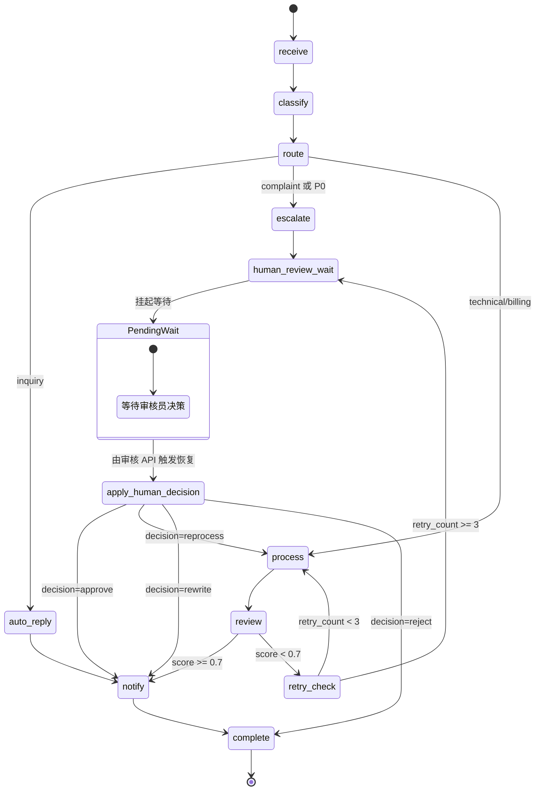

# 工单处理流程设计

## 1. 流程目标

工单处理流程需要完成从“用户提交问题”到“系统给出处理结果”的闭环。流程设计应满足以下要求：

- 能根据工单内容自动分类和识别优先级。
- 能对不同类型工单走不同处理路径。
- 能对普通工单生成解决方案并审核质量。
- 能对低质量结果进行有限次数重试。
- 能记录状态变化并实时推送给前端。

## 2. 状态节点

| 节点 | 职责 | 典型状态 |
| --- | --- | --- |
| `receive` | 接收工单，初始化上下文和 trace | `received` |
| `classify` | 识别分类和优先级 | `classifying` |
| `route` | 根据分类和优先级选择路径 | 不修改状态 |
| `auto_reply` | 为咨询类工单生成自动回复 | `processing` |
| `escalate` | 对投诉或高优先级工单进行升级 | `processing` |
| `process` | 生成普通工单解决方案 | `processing` |
| `review` | 审核处理结果质量 | `reviewing` |
| `retry_check` | 检查是否继续重试 | `processing` 或 `failed` |
| `handle_failure` | 处理多次失败场景 | `failed` |
| `human_review_wait` | 挂起工单等待人工审核（v1.0 新增） | `pending_human_review` |
| `apply_human_decision` | 接收人工决策并恢复工作流（v1.0 新增） | `processing` / `reviewing` |
| `notify` | 推送处理结果 | `completed` 前置 |
| `complete` | 完成归档 | `completed` |

## 3. 状态流转图

注：`human_review_wait` 之后工作流本次执行结束；审核员提交决策后由 API 触发新的工作流执行，从 `apply_human_decision` 节点开始。详细机制参见 [09_人工审核工作台设计.md](./09_人工审核工作台设计.md)。

## 4. 路由规则

| 条件 | 下一节点 | 设计原因 |
| --- | --- | --- |
| 分类为 `inquiry` | `auto_reply` | 咨询类问题通常可直接生成说明性回复 |
| 分类为 `complaint` | `escalate` | 投诉类问题需要更谨慎，模拟升级人工 |
| 优先级为 `P0` | `escalate` | 紧急问题不直接自动闭环 |
| 其他普通问题 | `process` | 进入处理和审核流程 |

## 5. 审核与重试

审核 Agent 输出 `review_score`。当前阈值由配置项 `review_threshold` 控制，默认值为 `0.7`。

- `review_score >= 0.7`：进入通知和完成流程。
- `review_score < 0.7` 且重试次数未超限：返回处理节点重新生成方案。
- 重试次数达到上限：进入失败处理。

这种设计体现了“生成后校验”的思想，也能在论文中说明系统如何降低低质量输出直接返回给用户的风险。

## 6. 实时更新机制

工单提交后，后端通过 `asyncio.create_task()` 后台执行工作流。每个节点完成后，系统会：

- 合并当前节点输出到工单状态。
- 将最新状态写入数据库。
- 构造 WebSocket 消息。
- 推送给单工单订阅连接和全局监控连接。

前端因此可以在详情页或监控页展示实时进度。

## 7. 异常处理

当工作流执行异常时，系统会捕获异常并执行以下动作：

- 将工单状态写为 `failed`。
- 保存错误信息。
- 通过 WebSocket 推送失败消息。
- 在日志中记录异常，便于定位问题。

