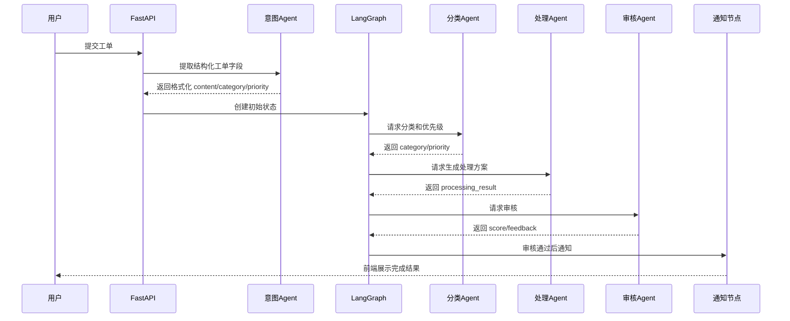

# Agent 角色与职责设计

## 1. 设计原则

Agent 设计遵循以下原则：

- 单一职责：每个 Agent 只负责一个主要任务。
- 输入输出结构化：Agent 输出尽量使用 JSON 或固定字段，便于后续节点消费。
- 可降级：LLM 不可用时保留基础规则或默认处理。
- 可观察：关键调用过程应能被 trace/span 记录。

## 2. Agent 总览

| Agent | 主要职责 | 输入 | 输出 |
| --- | --- | --- | --- |
| TicketIntentAgent | 自然语言工单意图理解与结构化 | 用户原始描述 | `title`、`category`、`priority`、`impact`、`expectation`、格式化 `content` |
| ClassifierAgent | 工单分类和优先级判断 | 工单内容 | `category`、`priority`、`reason` |
| ReActProcessorAgent | 生成处理方案并按需调用工具 | 内容、分类、优先级、知识库上下文 | `result`、`references`、工具调用历史 |
| ReviewerAgent | 审核处理方案质量 | 原始内容、处理结果、分类 | `score`、`feedback` |
| CoordinatorAgent | 升级、失败处理、报告生成 | 工单状态或工单集合 | 升级结果、失败处理结果、报告 |

## 3. TicketIntentAgent

TicketIntentAgent 是工单创建接口中的入口 Agent。它在 LangGraph 工作流启动前执行，负责把用户随手输入的问题描述转成后续 Agent 更容易消费的结构化工单正文。

主要提取字段包括：

- `title`：一句话问题标题。
- `category`：初步分类。
- `priority`：初步优先级。
- `impact`：影响范围。
- `expectation`：用户期望处理结果。
- `contact`：联系方式。
- `occurred_at`：发生时间。
- `confidence` 和 `reason`：意图判断置信度与原因。

LLM 不可用时，TicketIntentAgent 使用关键词、联系方式正则和时间正则进行本地规则提取，保证工单仍可创建。

## 4. ClassifierAgent

ClassifierAgent 是工单进入系统后的第一个智能判断节点。它需要根据用户描述识别：

- 问题属于技术、账务、投诉还是咨询。
- 问题优先级是 P0、P1、P2 还是 P3。
- 给出简短分类理由。

分类结果会直接影响后续路由，因此它是系统协同流程中的关键入口。

### 降级规则

当 LLM 调用失败时，可使用关键词规则进行兜底。例如：

- “崩溃”“无法登录”“报错”倾向于技术问题。
- “退款”“账单”“扣费”倾向于账务问题。
- “投诉”“不满”倾向于投诉。
- “如何”“怎么”“咨询”倾向于咨询。

## 5. ReActProcessorAgent

ReActProcessorAgent 负责生成工单解决方案。对于技术和账务类工单，它应结合分类结果、优先级和知识库检索内容给出具体处理建议。

设计上，ReActProcessorAgent 不负责决定是否通过审核，也不负责通知用户。这些职责分别交给 ReviewerAgent 和工作流后续节点。

## 6. ReviewerAgent

ReviewerAgent 负责从质量角度评估处理结果。评分范围为 0 到 1，默认通过阈值为 0.7。

评分可以考虑以下维度：

- 准确性：是否回应了用户问题。
- 完整性：是否包含必要步骤。
- 可执行性：用户或客服是否能据此操作。
- 专业性：表达是否清晰、礼貌、可靠。

审核结果用于决定是否进入通知流程或返回处理节点重试。

## 7. CoordinatorAgent

CoordinatorAgent 负责处理非普通闭环流程，包括：

- 投诉类工单升级。
- P0 紧急问题升级。
- 多次重试失败后的兜底处理。
- 后续可扩展的报告生成。
- **人工审核辅助决策建议**（v1.0 新增）。

### 6.1 辅助决策建议（v1.0 新增）

当工单进入 `human_review_wait` 节点时，CoordinatorAgent 调用 `suggest_decision` 方法，为审核员提供决策辅助。建议内容包括：

- `recommended_decision`：推荐决策（approve / reject / rewrite / reprocess）。
- `confidence`：置信度 0-1。
- `reasoning`：建议理由。
- `key_concerns`：审核员应重点关注的字段。

LLM 不可用时按规则降级（详见 [09_人工审核工作台设计.md](./09_人工审核工作台设计.md)）。

在本科毕设范围内，CoordinatorAgent 主要用于体现 Supervisor/Coordinator 思想，不实现复杂人工客服系统。

## 8. Agent 协同示例

