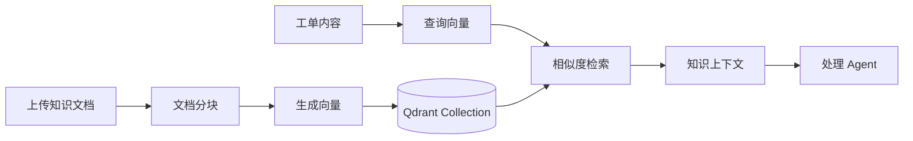

# 知识库与 RAG 设计

## 1. 设计目标

知识库模块用于为处理 Agent 提供外部知识支持。用户上传常见问题、处理手册或业务规则后，系统将文档分块并写入向量数据库。处理工单时，ProcessorAgent 可先检索相关知识片段，再结合工单内容生成处理方案。

## 2. 模块结构



## 3. 知识库上传流程

接口层接收 `title`、`content`、`category` 字段后，调用知识库工具完成文档写入。

基础流程如下：

1. 校验标题和正文是否为空。
2. 将正文按固定大小切分为多个片段。
3. 调用 Embedding 服务生成向量。
4. 将文本片段、元数据和向量写入 Qdrant。
5. 返回新增分块数量。

## 4. 检索增强流程

处理 Agent 在生成解决方案前，可以使用工单内容作为查询语句：

1. 对工单内容生成查询向量。
2. 在 Qdrant 中检索相似知识片段。
3. 过滤低相似度结果。
4. 将 top-k 片段拼接为上下文。
5. 将上下文连同工单内容传给 LLM。

## 5. 可选依赖设计

知识库不是工单流程的强依赖。系统启动时会尝试初始化 Qdrant，如果失败，则记录警告并继续启动核心服务。

这样设计的原因是：

- 避免演示时因向量数据库未启动导致整个系统不可用。
- 保证核心多 Agent 流程可以独立运行。
- 便于论文中说明系统的降级能力。

## 6. 知识数据示例

```json
{
  "title": "登录失败处理手册",
  "content": "当用户反馈无法登录时，先确认账号状态，再检查密码错误次数和服务端错误日志。",
  "category": "technical"
}
```

## 7. 本科毕设范围

本项目只实现基础 RAG 流程，不展开以下复杂能力：

- 文档权限隔离。
- 多知识库版本管理。
- 混合检索和重排序。
- 自动知识过期检测。
- 人工标注和知识质量评分。

