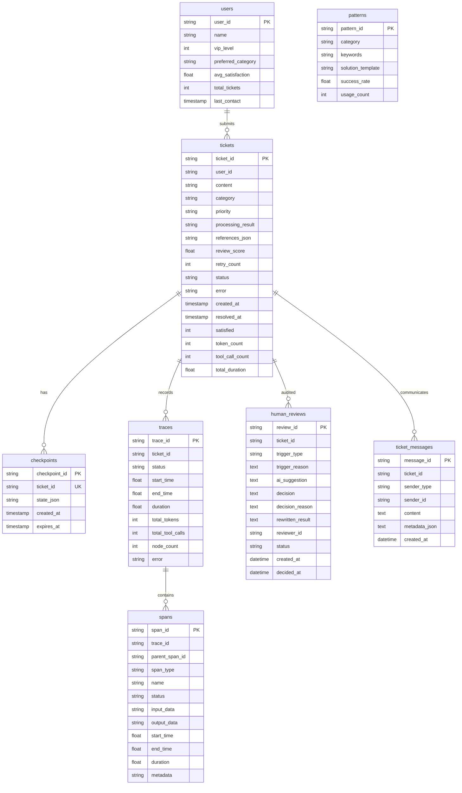

# 数据存储设计

## 1. 设计目标

数据存储模块需要支撑工单处理闭环、用户上下文、工作流检查点、执行追踪、人工审核、用户补充沟通和基础统计分析。当前系统使用 SQLAlchemy 2.0 async 作为统一数据访问层，主数据库为 MySQL。Pydantic 模型负责 API 入参和响应校验，ORM 模型负责实际表结构与持久化。

数据库相关代码集中在两个文件：

- `src/multi_agent_system/models/db.py`：SQLAlchemy ORM 表定义。
- `src/multi_agent_system/core/database.py`：异步数据库管理器、CRUD 方法、旧 SQL 兼容适配层。

## 2. 核心表结构

注：`tickets.status` 枚举值包含 `pending_human_review` 和 `waiting_user_input`。前者表示工单等待审核员决策，后者表示审核员已经请求用户补充信息，工作流暂停等待用户回复。

## 3. 表说明

### 3.1 tickets

`tickets` 是系统核心业务表，用于保存工单内容、分类结果、优先级、处理结果、审核评分、重试次数和最终状态。

主要字段：

- `ticket_id`：工单唯一标识。
- `content`：用户提交的原始内容。
- `category`：分类结果。
- `priority`：优先级。
- `processing_result`：处理 Agent、人工改写或恢复流程生成的最终结果。
- `references_json`：处理过程引用的知识库片段列表，JSON 字符串形式保存。
- `review_score`：审核评分。
- `status`：当前状态。
- `status=waiting_user_input`：人工审核请求用户补充后进入该状态，只有此状态允许调用用户补充接口。
- `satisfied`：用户满意度反馈。
- `token_count`、`tool_call_count`、`total_duration`：用于效率统计和执行分析。

### 3.2 users

`users` 用于保存简单用户信息和历史偏好。当前仅作为扩展上下文使用，不实现复杂用户权限。

### 3.3 checkpoints

`checkpoints` 用于保存工作流中间状态，支持后续恢复能力。当前系统已有表结构和基础方法，恢复逻辑可作为后续扩展。

关键字段：

- `checkpoint_id`：检查点唯一标识。
- `ticket_id`：关联工单 ID，唯一约束。
- `state_json`：序列化后的工作流状态。
- `expires_at`：过期时间，系统可清理过期检查点。

### 3.4 patterns

`patterns` 用于保存模式匹配知识库或处理模板，支持按分类查找历史成功模式。

关键字段：

- `pattern_id`：模式唯一标识。
- `category`：适用分类。
- `keywords`：关键词集合。
- `solution_template`：处理模板。
- `success_rate`、`usage_count`：后续用于模式效果评估。

### 3.5 traces

`traces` 用于记录一次工单处理的整体执行情况，包括开始时间、结束时间、总耗时、节点数量、token 数量和错误信息。

### 3.6 spans

`spans` 用于记录 trace 下的节点或调用明细。通过 `parent_span_id` 可以构建执行树。

`spans.metadata` 在 ORM 中映射为 `metadata_` 属性，避免与 SQLAlchemy `Base.metadata` 冲突；对外通过字典仍返回 `metadata` 字段。

### 3.7 human_reviews

`human_reviews` 用于持久化人工审核记录。每次工单进入 `human_review_wait` 时插入一行 `pending` 记录，审核员提交决策后更新为 `decided`。详细字段说明见 [09_人工审核工作台设计.md](./09_人工审核工作台设计.md)。

主要字段：

- `review_id`：审核记录唯一标识，格式 `HR-<generated_id>`。
- `ticket_id`：关联工单 ID。
- `trigger_type`：触发类型，枚举值为 `escalate` / `review_failed` / `error_fallback` / `user_request`。
- `ai_suggestion`：CoordinatorAgent 生成的辅助决策建议 JSON 字符串。
- `decision`：审核员最终决策，枚举值为 `approve` / `reject` / `rewrite` / `reprocess` / `request_info`。
- `reviewer_id`：审核员标识。
- `status`：`pending` 或 `decided`。

### 3.8 ticket_messages

`ticket_messages` 用于持久化用户补充信息和审核员补充请求。它与工作流内部的 `TicketState.messages` 不同：`TicketState.messages` 主要用于节点调试和详情展示，`ticket_messages` 是业务沟通记录，会在用户补充恢复流程中被读取并拼接为 `conversation_context`。

主要字段：

- `message_id`：消息唯一标识，格式 `TM-<generated_id>`。
- `ticket_id`：关联工单 ID。
- `sender_type`：发送者类型，枚举值为 `user` / `reviewer` / `system` / `agent`。
- `sender_id`：用户或审核员标识，可为空。
- `content`：消息正文，不能为空。
- `metadata_json`：扩展元数据，例如 `{"source":"request_info","review_id":"HR-..."}`。
- `created_at`：创建时间。

典型写入链路：

1. 审核员在审核工作台点击“请求补充”，系统写入 `sender_type=reviewer` 消息。
2. 工单详情页进入 `waiting_user_input`，用户提交订单号、支付流水号等补充信息，系统写入 `sender_type=user` 消息。
3. `resume_from_user_input` 读取最近 20 条消息作为上下文，恢复 `process → review` 流程。

## 4. 索引设计

当前数据库包含以下主要索引：

- `idx_tickets_user`：按用户查询工单。
- `idx_tickets_status`：按状态筛选工单。
- `idx_tickets_category`：按分类筛选工单。
- `idx_tickets_status_created`：按状态和创建时间筛选工单，替代 SQLite partial index，适配 MySQL 8。
- `idx_checkpoints_expires`：清理过期检查点。
- `idx_patterns_category_usage`：按分类和使用次数查找模式模板。
- `idx_traces_ticket`：按工单查询 trace。
- `idx_traces_status`：按执行状态筛选 trace。
- `idx_spans_trace`：按 trace 查询 span。
- `idx_spans_parent`：构建 span 树。
- `idx_spans_type`：按 span 类型统计节点、工具调用、人工决策等。
- `idx_hr_status`：按状态查询审核队列。
- `idx_hr_ticket`：按工单查询历史审核。
- `idx_hr_trigger`：按触发类型筛选审核。
- `idx_hr_reviewer`：按审核员统计工作量。
- `idx_tm_ticket_created`：按工单和创建时间查询沟通记录。
- `idx_tm_sender`：按发送者类型筛选沟通记录。

这些索引能满足列表筛选、详情查询、执行追踪和审核队列展示需求。

## 5. SQLAlchemy 迁移与兼容设计

当前代码已经从早期 SQLite 文档方案迁移到 SQLAlchemy 2.0 async + MySQL。为了降低迁移风险，`DatabaseManager` 做了三层兼容：

- 公共 CRUD 方法保持原调用方式，例如 `save_ticket()`、`list_tickets()`、`save_trace()`、`create_pending_review()`。
- 对 `trace.py`、`evaluation.py` 等旧模块仍可能使用的原始 SQL 提供 `_RawConnShim`，把 `?` 占位符转换为 SQLAlchemy 命名占位符。
- `_orm_to_dict()` 将 ORM 对象转换为原有字典形状，并把 `datetime` 序列化为字符串，避免前端和测试断裂。

这种设计使代码既能展示生产式数据库建模，又能保持毕业设计演示稳定。

## 6. 数据安全与配置约束

数据库连接串通过 `config.yaml` 或环境变量 `DATABASE_URL` 配置，文档和仓库不应提交真实密码、生产凭证或 `.env` 文件。前端设置页只展示是否配置密钥，不展示完整敏感值。
