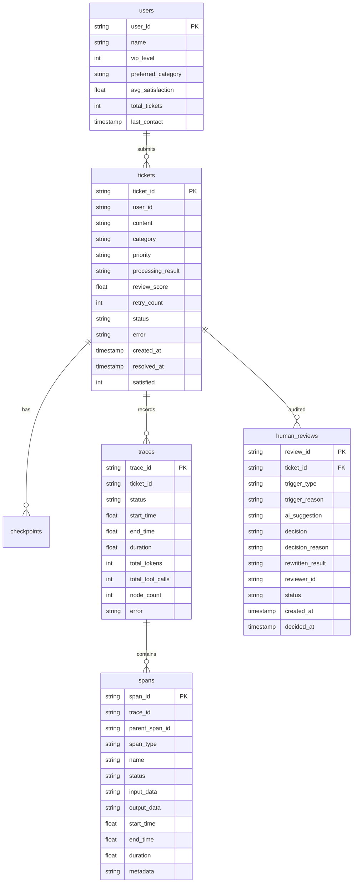

# 数据存储设计

## 1. 设计目标

数据存储模块需要支撑工单处理闭环、用户上下文、工作流检查点、执行追踪和基础统计分析。当前系统使用 SQLite 作为主数据库，适合本地演示和毕业设计开发。

## 2. 核心表结构

注：`tickets.status` 枚举值新增 `pending_human_review`，工单进入 `human_review_wait` 节点时被设置。

## 3. 表说明

### 3.1 tickets

`tickets` 是系统核心业务表，用于保存工单内容、分类结果、优先级、处理结果、审核评分、重试次数和最终状态。

主要字段：

- `ticket_id`：工单唯一标识。
- `content`：用户提交的原始内容。
- `category`：分类结果。
- `priority`：优先级。
- `processing_result`：处理 Agent 或自动回复节点生成的结果。
- `review_score`：审核评分。
- `status`：当前状态。
- `satisfied`：用户满意度反馈。

### 3.2 users

`users` 用于保存简单用户信息和历史偏好。当前仅作为扩展上下文使用，不实现复杂用户权限。

### 3.3 checkpoints

`checkpoints` 用于保存工作流中间状态，支持后续恢复能力。当前系统已有表结构和基础方法，恢复逻辑可作为后续扩展。

### 3.4 traces

`traces` 用于记录一次工单处理的整体执行情况，包括开始时间、结束时间、总耗时、节点数量、token 数量和错误信息。

### 3.5 spans

`spans` 用于记录 trace 下的节点或调用明细。通过 `parent_span_id` 可以构建执行树。

### 3.6 human_reviews（v1.0 新增）

`human_reviews` 用于持久化人工审核记录。每次工单进入 `human_review_wait` 时插入一行 `pending` 记录，审核员提交决策后更新为 `decided`。详细字段说明见 [09_人工审核工作台设计.md](./09_人工审核工作台设计.md)。

主要字段：

- `review_id`：审核记录唯一标识，格式 `HR-<trace_id>`。
- `ticket_id`：关联工单 ID。
- `trigger_type`：触发类型，枚举值为 `escalate` / `review_failed` / `error_fallback` / `user_request`。
- `ai_suggestion`：CoordinatorAgent 生成的辅助决策建议 JSON。
- `decision`：审核员最终决策，枚举值为 `approve` / `reject` / `rewrite` / `reprocess`。
- `reviewer_id`：审核员标识。
- `status`：`pending` 或 `decided`。

## 4. 索引设计

当前数据库包含以下主要索引：

- `idx_tickets_user`：按用户查询工单。
- `idx_tickets_status`：按状态筛选工单。
- `idx_tickets_category`：按分类筛选工单。
- `idx_traces_ticket`：按工单查询 trace。
- `idx_spans_trace`：按 trace 查询 span。
- `idx_spans_parent`：构建 span 树。
- `idx_hr_status`：按状态查询审核队列（v1.0 新增）。
- `idx_hr_ticket`：按工单查询历史审核（v1.0 新增）。
- `idx_hr_trigger`：按触发类型筛选审核（v1.0 新增）。
- `idx_hr_reviewer`：按审核员统计工作量（v1.0 新增）。
- `idx_tickets_pending`：部分索引，加速 `pending_human_review` 状态的工单查询（v1.0 新增）。

这些索引能满足列表筛选、详情查询、执行追踪和审核队列展示需求。

## 5. 数据存储取舍

本科毕设阶段选择 SQLite，而不是 MySQL 或 PostgreSQL，主要原因是部署简单、环境依赖少、演示稳定。系统表结构保留了迁移到关系型数据库的可能性，后续可将 `_SCHEMA_SQL` 拆分为正式迁移脚本。

