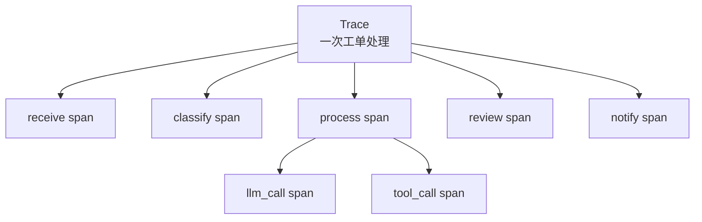

# 可观测与执行追踪设计

## 1. 设计目标

多 Agent 系统的执行过程比普通 CRUD 系统更复杂。为了便于调试、展示和论文分析，本项目设计了执行追踪能力，用于记录一次工单处理经过的节点、耗时、输入输出和执行状态。

## 2. Trace 与 Span 模型

| 概念 | 含义 |
| --- | --- |
| Trace | 一次完整工单处理过程 |
| Span | Trace 中的一个节点或一次调用 |
| span_type | 节点、LLM 调用、工具调用、人工决策（v1.0 新增）等类型 |
| status | 执行成功、失败或降级 |
| duration | 节点耗时 |
| input_data/output_data | 输入输出摘要 |

## 3. 追踪流程

1. `receive` 节点开始时创建 trace。
2. 每个工作流节点创建一个 span。
3. 节点完成后写入输出、状态和耗时。
4. 前端通过 trace 接口查询执行树。
5. 统计页面可基于 trace 数据展示耗时和调用指标。

## 4. 接口支持

系统提供以下追踪相关接口：

- `GET /api/tickets/{ticket_id}/trace`：查询某个工单的完整执行树。
- `GET /api/traces`：查询 trace 列表。
- `GET /api/traces/{trace_id}/stats`：查询 trace 耗时统计。

## 5. 实时监控

除了持久化 trace，系统还通过 WebSocket 推送节点完成事件。推送内容包括：

- 工单 ID。
- 当前状态。
- 节点名称。
- 中文消息。
- 分类、优先级、审核评分、重试次数等摘要数据。
- 最近完成 span 的摘要信息。

## 6. 指标设计

系统基础设施中包含 Prometheus 指标采集能力，可记录：

- HTTP 请求数量和耗时。
- 当前活跃请求数。
- Agent 执行次数和耗时。
- LLM 调用情况。
- 缓存命中情况。

本科毕设中可将 Prometheus 和 Grafana 作为增强演示项，不作为核心必需项。

## 7. 论文展示价值

执行追踪能支撑以下论文内容：

- 多智能体系统可解释性分析。
- 不同节点耗时对比。
- 审核失败和重试流程展示。
- Agent 与工具调用链路说明。
- 系统异常时的错误定位过程。
- **人机协同全过程展示**（v1.0 新增）：通过 `human_decision` span 完整记录"AI 链路 → 暂停 → 人工介入 → 恢复 → 后续 AI 链路"的过程。

### 7.1 human_decision span（v1.0 新增）

工单进入 `human_review_wait` 时，CoordinatorAgent 调用 `suggest_decision` 创建一个 `pending` 状态的 span；审核员提交决策后，span 被更新为 `decided`，并写入 `output_data.decision`、`output_data.reviewer_id`、`output_data.ai_adopted` 等字段。

| 字段 | 说明 |
| --- | --- |
| span_type | `human_decision` |
| input_data | `trigger_type`、`trigger_reason`、`ai_suggestion` |
| output_data | `decision`、`decision_reason`、`reviewer_id`、`ai_adopted`（决策是否与 AI 建议一致） |
| duration | 从挂起到决策的耗时（秒级到分钟级） |
| metadata | 关联的 `review_id` |

`ai_adopted` 字段是计算 `ai_adoption_rate`（AI 建议采纳率）指标的基础，该指标是论文"人机协同效果评估"章节的核心数据。

