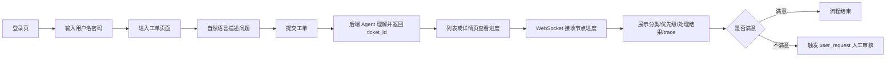

# 前端页面与交互设计

## 1. 设计目标

前端作为系统演示和操作入口，需要让用户能够登录系统、提交工单、查看处理进度、检查处理结果、上传知识库内容、处理人工审核队列，并观察 Agent 执行状态。界面定位为轻量管理端，不做复杂客服坐席系统。

## 2. 页面结构

| 页面 | 文件 | 功能 |
| --- | --- | --- |
| 登录 | `Login.tsx` | 用户名密码登录，成功后进入系统 |
| 仪表盘 | `Dashboard.tsx` | 展示处理统计、趋势和概览 |
| 工单列表 | `Tickets.tsx` | 查看工单列表，支持状态和分类筛选 |
| 工单详情 | `TicketDetail.tsx` | 查看单个工单内容、进度、结果、trace |
| 知识库 | `Knowledge.tsx` | 查看和上传知识文档 |
| Agent 监控 | `AgentMonitor.tsx` | 查看执行轨迹、决策点和 Agent 状态 |
| 审核工作台 | `ReviewWorkbench.tsx` | 审核员处理待审核工单 |
| 设置 | `Settings.tsx` | 展示只读系统配置摘要 |

### 2.1 AI 创建工单

工单列表页提供 `AgentTicketComposer` 组件，用户不需要手工填写分类、优先级等传统表单，只需要输入自然语言描述。后端 `TicketIntentAgent` 会自动提取问题标题、分类、优先级、影响范围和联系方式。

页面交互特点：

- 支持填写 `user_id`，用于后续用户上下文扩展。
- 提供示例工单，便于课堂演示。
- 提交后调用 `POST /api/tickets`，成功后刷新列表。
- 通过徽章提示“Agent 将自动生成标题、分类、优先级、影响范围”。

### 2.2 审核工作台

页面采用双栏布局：

- **左栏（30%）**：待审核队列。支持按 `trigger_type`、`category`、`priority` 筛选，按优先级 + 等待时长排序，每条显示工单摘要、触发类型徽章、优先级色块、AI 建议摘要。
- **右栏（70%）**：当前选中工单的审核面板。从上到下依次为：工单原文与元数据 → AI 处理结果展示 → 执行 trace 时间线 → AI 辅助决策建议卡（高亮显示置信度 > 0.7 的建议） → 审核员决策区（通过 / 改写 / 重处理 / 驳回 四个按钮 + 改写文本框 + 必填理由框）。

关键交互：

| 交互 | 行为 |
| --- | --- |
| WebSocket `review_requested` | 队列顶部出现新条目，并显示 toast 提示 |
| WebSocket `review_decided` | 若为当前选中工单，刷新为已决策状态 |
| 点击"通过" | 弹出理由输入框 → POST decision=approve |
| 点击"改写" | 展开 rewritten_result 文本框 + 理由 → POST decision=rewrite |
| 点击"重处理" | 二次确认 → POST decision=reprocess |
| 点击"驳回" | 二次确认 + 必填理由 → POST decision=reject |

详细设计参见 [09_人工审核工作台设计.md](./09_人工审核工作台设计.md) 第 7 章。

## 3. 交互流程

## 4. 数据类型

前端类型定义位于 `web/src/types/index.ts`，主要包括：

- `Ticket`：工单详情。
- `TicketStatus`：工单状态枚举。
- `TicketCategory`：分类枚举。
- `TicketPriority`：优先级枚举。
- `Trace`、`Span`、`TraceDetail`：执行追踪相关类型。
- `TraceDecision`、`TraceDecisionsResponse`：决策追踪相关类型。
- `ReviewQueueItem`、`ReviewDetail`、`ReviewDecisionRequest`：人工审核工作台相关类型。
- `AuthState`：登录状态。
- `Analytics`：统计数据。
- `WSMessage`：WebSocket 消息。

## 5. 状态展示规则

| 状态 | 展示含义 |
| --- | --- |
| `received` | 工单已接收 |
| `classifying` | 正在智能分类 |
| `processing` | 正在处理 |
| `reviewing` | 正在审核处理结果 |
| `pending_human_review` | 等待人工审核 |
| `completed` | 工单处理完成 |
| `failed` | 工单处理失败 |

## 6. 设计取舍

前端只实现基础登录和会话保护，不实现完整账号体系、复杂权限、客服坐席分配和消息会话。页面重点服务于毕设演示：

- 能直观看到工单从提交到完成的变化。
- 能展示多 Agent 每个节点的执行结果。
- 能上传知识文档体现 RAG 能力。
- 能通过审核工作台展示人机协同闭环。
- 能通过统计页展示系统运行效果。
