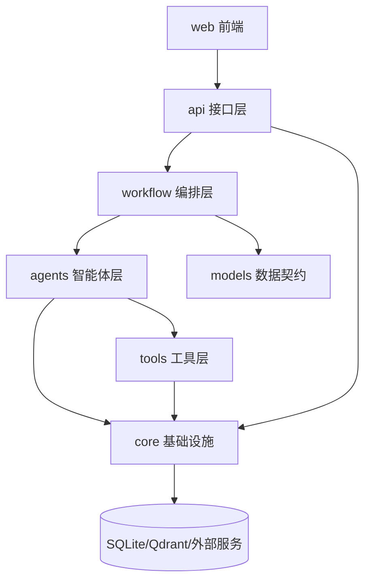

# 项目目录架构设计

## 1. 设计目标

本项目由早期 AI Agent 学习项目整理而来，历史代码中同时存在基础 Agent 示例、RAG 学习模块、多智能体工单系统、旧前端页面、实验计划和毕业设计文档。为了让项目更符合“基于多智能体协同的智能工单处理系统设计与实现”的毕业设计主题，需要对目录架构进行分层设计。

目录架构设计目标如下：

- 主业务代码聚焦智能工单处理系统。
- 历史学习产物保留但不混入主源码。
- 测试目录与主业务模块对应，便于回归验证。
- 文档目录能支撑论文、设计、接口、测试和项目管理。
- 部署脚本、数据、日志和临时产物边界清晰。

## 2. 当前目录问题

当前项目经过初步整理后，主要问题如下：

| 问题 | 表现 | 影响 |
| --- | --- | --- |
| 学习产物和毕设主线混杂 | 早期 `basic_agents`、examples、历史测试曾位于主目录 | 容易让论文主线发散 |
| RAG 模块定位不清 | `src/rag_systems/` 曾同时包含个人知识库、论文阅读助手、文档处理工作流等学习内容 | 已将论文阅读助手和文档处理工作流归档 |
| 文档来源较多 | `docs/project-guide.md`、`docs/design-spec/`、`docs/superpowers/`、`openspec/` 并存 | 后续维护容易不知道以哪个为准 |
| 测试目录存在历史分组 | `tests/test_multi_agent` 与 `tests/multi_agent_system` 曾同时覆盖工单系统 | 已合并到 `tests/multi_agent_system` |
| 运行产物目录需要约束 | `data/`、`logs/`、`web/dist/` 等可能包含生成内容 | 需要避免把运行产物纳入核心设计 |

## 3. 目标目录结构

建议项目最终保持以下结构：

```text
ai-agent-learning/
├── README.md
├── requirements.txt
├── Dockerfile
├── docker-compose.yml
├── src/
│   ├── multi_agent_system/
│   │   ├── api/
│   │   ├── agents/
│   │   ├── core/
│   │   ├── models/
│   │   ├── tools/
│   │   ├── workflow/
│   │   └── config.py
│   └── rag_systems/
│       └── personal_knowledge_base/
├── web/
│   ├── src/
│   ├── public/
│   └── package.json
├── tests/
│   ├── api/
│   ├── agents/
│   ├── core/
│   ├── multi_agent_system/
│   └── rag_systems/
├── docs/
│   ├── design-spec/
│   ├── project-guide.md
│   └── 毕设论文要求/
├── archive/
│   └── learning/
├── scripts/
├── data/
└── logs/
```

## 4. 顶层目录职责

| 目录 | 定位 | 是否属于毕设主线 | 维护规则 |
| --- | --- | --- | --- |
| `src/` | Python 后端与可复用能力源码 | 是 | 只放可运行源码，不放临时脚本 |
| `src/multi_agent_system/` | 智能工单系统后端核心 | 是 | 后续开发优先落在这里 |
| `src/rag_systems/` | 个人知识库和 RAG 辅助能力 | 部分属于 | 只保留与知识库能力相关的模块 |
| `web/` | React 前端管理端 | 是 | 面向工单系统演示，不扩展无关业务 |
| `tests/` | 主项目自动化测试 | 是 | 与 `src/` 模块对应 |
| `docs/design-spec/` | 毕设设计规范 | 是 | 作为系统设计文档主入口 |
| `archive/learning/` | 历史学习产物归档 | 否 | 不作为主线继续开发 |
| `scripts/` | 部署、初始化、辅助脚本 | 是 | 脚本应有明确用途 |
| `data/` | 本地运行数据 | 否 | 不提交敏感或大体积运行数据 |
| `logs/` | 本地运行日志 | 否 | 不作为源代码维护 |
| `openspec/` | 历史变更方案 | 参考 | 可作为历史设计参考，不作为当前主文档 |

## 5. 后端源码分层

`src/multi_agent_system/` 是毕设后端主包，建议保持以下职责边界：

| 子目录 | 职责 | 可依赖 | 不应承担 |
| --- | --- | --- | --- |
| `api/` | FastAPI 应用、路由、WebSocket | `models`、`workflow`、`tools`、`core` | 复杂业务决策 |
| `agents/` | 分类、处理、审核、协调 Agent | `core`、`tools`、`models` | HTTP 请求处理 |
| `workflow/` | LangGraph 状态机、节点与路由 | `agents`、`models`、`core` | 前端展示逻辑 |
| `models/` | Pydantic 模型、枚举、数据契约 | 标准库、Pydantic | 数据库访问 |
| `tools/` | Agent 可调用工具，如知识库、通知、统计 | `core`、外部服务 SDK | 工作流编排 |
| `core/` | 数据库、缓存、重试、追踪、指标等基础设施 | 标准库、第三方库 | 具体业务页面逻辑 |

## 6. 前端源码分层

`web/src/` 是毕业设计前端主目录，建议保持以下结构：

| 子目录 | 职责 |
| --- | --- |
| `pages/` | 页面级功能，如仪表盘、工单列表、详情、知识库、监控、设置 |
| `components/layout/` | 页面布局、侧边栏、状态展示等结构组件 |
| `components/ui/` | 基础 UI 组件 |
| `hooks/` | API 请求、WebSocket 等复用逻辑 |
| `lib/` | API 客户端、工具函数 |
| `types/` | 与后端接口对齐的 TypeScript 类型 |

页面组件不直接承载复杂数据转换逻辑，复杂逻辑应下沉到 `hooks/` 或 `lib/`。

## 7. 测试目录设计

测试目录应围绕当前主线组织：

```text
tests/
├── api/                  # FastAPI 接口与健康检查
├── agents/               # Agent 集成和 ReAct Processor 测试
├── core/                 # 数据库、缓存、追踪、重试等基础设施
├── multi_agent_system/   # 工单系统工具与局部模块测试
└── rag_systems/          # RAG 模块测试
```

后续整理建议：

- `tests/test_multi_agent/` 已合并到 `tests/multi_agent_system/`。
- 保留 `tests/rag_systems/`，但论文主线只引用与知识库能力相关的测试。
- 历史基础 Agent、论文阅读助手和文档处理工作流测试已归档到 `archive/learning/tests/`。

## 8. 文档目录设计

文档优先级如下：

1. `docs/design-spec/`：当前毕业设计的主设计文档。
2. `README.md`：项目启动和整体说明。
3. `docs/project-guide.md`：代码阅读导览。
4. `docs/毕设论文要求/`：学校或导师给出的论文要求资料。
5. `docs/superpowers/`、`openspec/`：历史方案和实现计划，仅作参考。

后续新增正式设计内容时，应优先放入 `docs/design-spec/`，避免在多个目录散落重复说明。

## 9. 归档目录设计

`archive/learning/` 保存早期学习产物：

```text
archive/learning/
├── README.md
├── basic_agents/
├── examples/
├── logs/
├── rag_systems/
├── web_legacy/
└── tests/
```

归档规则：

- 可以保留历史代码，便于回看学习过程。
- 不作为毕业设计主线继续开发。
- 不允许主业务代码反向依赖归档代码。
- 归档测试可单独运行，但不纳入主回归测试路径。
- 归档示例产生的日志写入 `archive/learning/logs/`。

## 10. 依赖方向

建议依赖方向如下：



约束：

- `archive/` 不被 `src/` 依赖。
- `web/` 只通过 HTTP/WebSocket 与后端交互。
- `api/` 可以调度 workflow，但不直接实现 Agent 推理细节。
- `models/` 不依赖 `api/`、`agents/`、`workflow/`。
- `core/` 不依赖前端和 API 页面逻辑。

## 11. 后续整理路线

### 阶段一：已完成或正在完成

- 将基础 Agent 学习产物归档到 `archive/learning/`。
- 将 `src/basic_agents` 从主源码中移除。
- 将 RAG 复用的文本清洗函数迁移到 RAG 模块自身。
- 建立 `docs/design-spec/` 文档体系。

### 阶段二：已完成或正在完成

- 已合并 `tests/test_multi_agent/` 到 `tests/multi_agent_system/`。
- 已将 `src/rag_systems/paper_reader_agent/` 归档到 `archive/learning/rag_systems/paper_reader_agent/`。
- 已将 `src/rag_systems/langgraph_workflow.py` 归档到 `archive/learning/rag_systems/langgraph_workflow.py`。
- 已将 `src/multi_agent_system/web_legacy/` 归档到 `archive/learning/web_legacy/`。
- `web/dist/` 未被 Git 跟踪，且 `dist/` 已在 `.gitignore` 中忽略。

### 阶段三：论文交付前整理

- README 聚焦毕设项目启动与演示。
- `docs/project-guide.md` 与 `docs/design-spec/` 保持一致。
- 删除无用运行日志和临时数据。
- 确认 `.env`、密钥和本地缓存不进入提交。

## 12. 验收标准

目录架构整理完成后，应满足以下标准：

- `src/` 中不再包含与工单系统无关的基础 Agent 学习示例。
- 主业务代码不依赖 `archive/`。
- `tests/` 中只保留主项目测试和当前仍需维护的 RAG 测试。
- `docs/design-spec/` 能解释系统设计、接口、测试和项目管理。
- 项目根目录不出现一次性临时脚本。
- 运行测试后不残留 `__pycache__`、`.pytest_cache` 等生成物。
