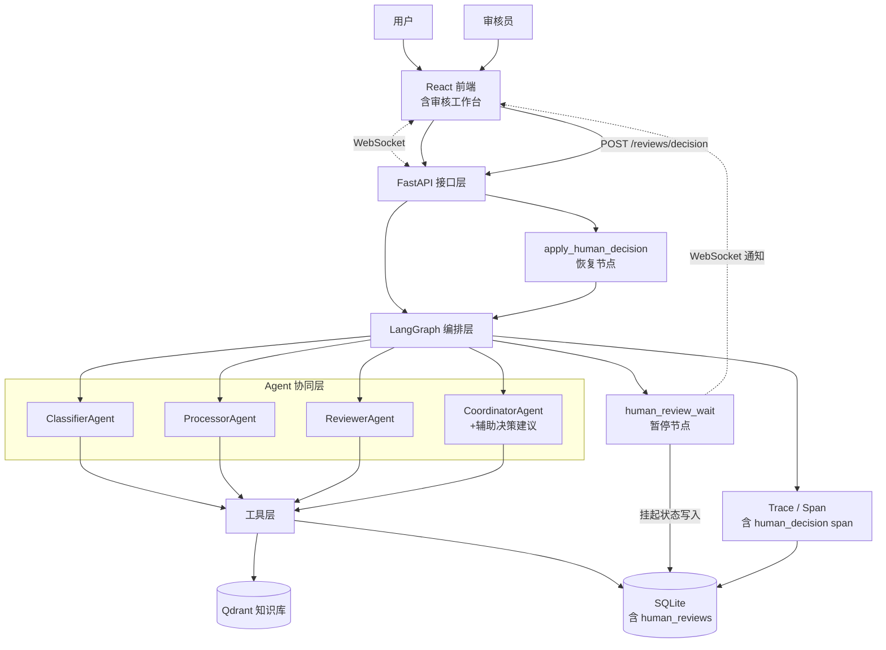
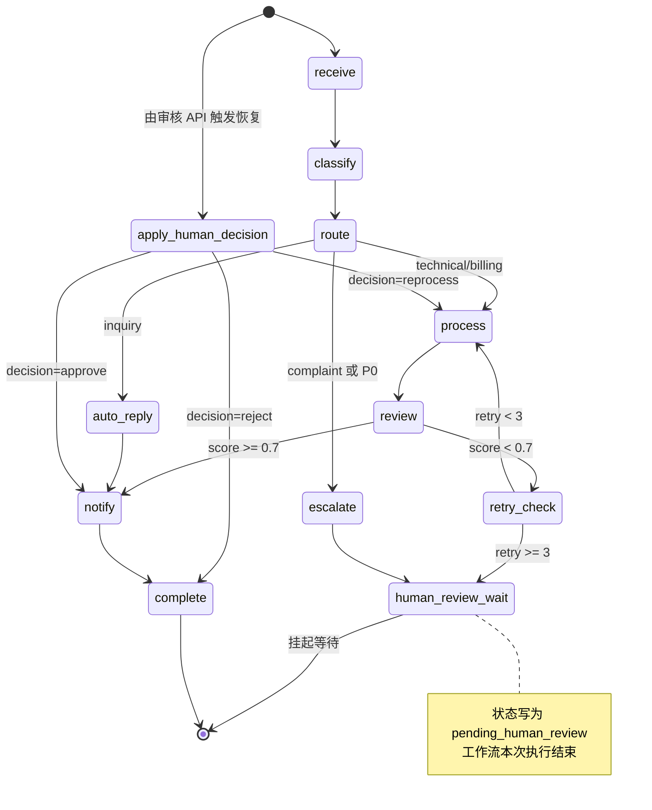
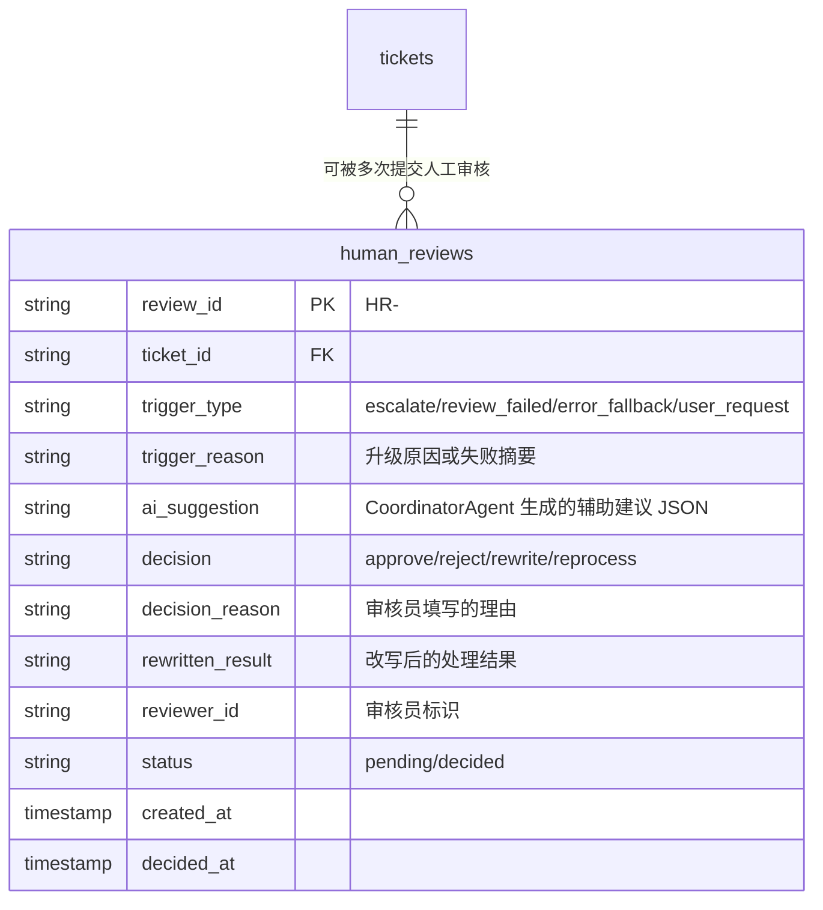
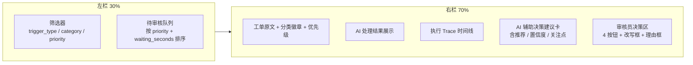

# 人工审核工作台设计

> 版本：v1.0
> 日期：2026-06-27
> 状态：新增章节，补齐 Agent 审核升级为人工审核的完整闭环
> 关联缺口：`escalate` 节点的"假升级"、`handle_failure` 直接归档、AI 审核失败兜底缺失

## 1. 设计背景

### 1.1 问题陈述

当前系统在以下三个场景下声称"转人工处理"，但实际只是写入一条文字消息后直接归档完成，没有真正的人工审核环节：

| 场景 | 当前代码位置 | 实际行为 | 期望行为 |
| --- | --- | --- | --- |
| P0 / 投诉工单 escalate | `workflow/graph.py:377` | 写"已升级至人工处理"消息后 → notify → complete | 挂起等待人工审核 |
| AI 审核失败重试超限 | `workflow/graph.py:491` | 走 `handle_failure → complete` | 转人工兜底审核 |
| 工作流异常 | `routes.py:595` | 工单状态写为 failed | 转人工异常处理 |

此外，工单完成后用户主动反馈"不满意"的场景，当前只记录 `satisfied=0`，没有触发任何复审流程。

### 1.2 设计目标

在毕设范围内引入**轻量但真实的人工审核闭环**：

- 让"升级人工"成为可被答辩演示的真实业务流程，而非空话
- 让 AI 审核失败有合理的兜底路径，避免直接返回低质量结果
- 让 CoordinatorAgent 承担"辅助人工决策"职责，体现 Agent + 人协同
- 所有审核动作被持久化和追踪，为论文分析提供数据

### 1.3 范围边界

| 纳入范围 | 不纳入范围（仍为展望） |
| --- | --- |
| 人工审核队列与决策接口 | 审核员账户体系与细粒度权限 |
| 工作流暂停 / 恢复机制 | 技能组分配与排班 |
| 审核员工作台前端页面 | SLA 超时自动升级 |
| CoordinatorAgent 辅助决策建议 | 多人会签 / 工单转派链路 |
| human_reviews 表持久化 | 真实邮件 / 短信通知审核员 |

## 2. 总体架构

### 2.1 升级后的架构图



### 2.2 与原架构的差异

| 维度 | 原架构 | 升级后 |
| --- | --- | --- |
| Agent 协同维度 | Agent ↔ Agent | Agent ↔ Agent + Agent ↔ 人 |
| 工单终态 | completed / failed | completed / failed / pending_human_review |
| 工作流模型 | 单次同步执行 | 同步执行 + 可暂停 + 可恢复 |
| CoordinatorAgent 职责 | 升级摘要、失败分析 | 增加"人工决策辅助建议" |
| 数据表 | 5 张 | 6 张（新增 human_reviews） |
| Span 类型 | node / llm_call / tool_call | 增加 human_decision |
| 前端页面 | 6 个 | 7 个（新增 ReviewWorkbench） |
| API 端点 | 工单 / 知识库 / 统计 / trace | 增加 /reviews/* |

## 3. 工作流升级

### 3.1 升级后的状态机



### 3.2 新增节点说明

#### 3.2.1 `human_review_wait`（暂停节点）

| 属性 | 说明 |
| --- | --- |
| 职责 | 将工单挂起，等待人工决策 |
| 输入 | `ticket_id`、`trigger_type`、`trigger_reason` |
| 副作用 | 1) 写入 `human_reviews` 行（status=pending）<br>2) 更新 `tickets.status = pending_human_review`<br>3) 调用 CoordinatorAgent 生成 `ai_suggestion`<br>4) 通过 WebSocket 推送 `review_requested` 事件<br>5) 结束本次工作流执行（返回 END） |
| 关键设计 | 不使用 LangGraph 原生 `interrupt`，而是写持久化状态后正常结束。恢复时由 API 触发新工作流（从 `apply_human_decision` 开始）。这种做法简化了 checkpointer 依赖，更适合 SQLite + 毕设场景 |

#### 3.2.2 `apply_human_decision`（恢复节点）

| 属性 | 说明 |
| --- | --- |
| 职责 | 接收人工决策，更新工单状态，决定后续路由 |
| 输入 | `decision`（approve / reject / rewrite / reprocess）、`rewritten_result`、`decision_reason` |
| 副作用 | 1) 更新 `human_reviews` 行（status=decided）<br>2) 记录 `human_decision` span<br>3) 根据 decision 分支：<br>　- approve：使用原 processing_result，跳到 notify<br>　- rewrite：使用 rewritten_result 替换 processing_result，跳到 notify<br>　- reprocess：清空 processing_result 与 retry_count，回到 process<br>　- reject：跳到 complete（标记为 rejected） |

### 3.3 触发点矩阵

| 触发点 | trigger_type | 进入条件 | 默认推荐决策 |
| --- | --- | --- | --- |
| 投诉 / P0 升级 | `escalate` | 路由判断为 complaint 或 P0 | reprocess 或 reject |
| AI 审核失败兜底 | `review_failed` | retry_count ≥ 3 且 review_score < 阈值 | rewrite 或 reject |
| 处理异常 | `error_fallback` | 工作流执行抛出未恢复异常 | reprocess |
| 用户主动申请 | `user_request` | 工单完成后用户反馈不满意 | reprocess |

### 3.4 与现有节点的衔接改动

| 原节点 | 原后继 | 升级后后继 |
| --- | --- | --- |
| `escalate` | `notify` | `human_review_wait` |
| `retry_check`（retry_count ≥ 3 分支） | `handle_failure` | `human_review_wait` |
| `handle_failure`（异常分支） | `END` | `human_review_wait`（异常 → `error_fallback`） |
| 工单完成后的反馈接口 | 仅记录 satisfied=0 | 满足条件时创建新的 `user_request` 审核记录 |

## 4. 数据模型

### 4.1 新增表 `human_reviews`



### 4.2 `tickets` 表变更

新增状态枚举值：

```python
class TicketStatus(str, Enum):
    RECEIVED = "received"
    CLASSIFYING = "classifying"
    PROCESSING = "processing"
    REVIEWING = "reviewing"
    PENDING_HUMAN_REVIEW = "pending_human_review"  # 新增
    COMPLETED = "completed"
    FAILED = "failed"
```

### 4.3 索引设计

```sql
CREATE INDEX idx_hr_status ON human_reviews(status);
CREATE INDEX idx_hr_ticket ON human_reviews(ticket_id);
CREATE INDEX idx_hr_trigger ON human_reviews(trigger_type);
CREATE INDEX idx_hr_reviewer ON human_reviews(reviewer_id);
CREATE INDEX idx_tickets_pending ON tickets(status, created_at) WHERE status = 'pending_human_review';
```

`idx_tickets_pending` 是部分索引，确保审核队列查询性能。

## 5. CoordinatorAgent 扩展

CoordinatorAgent 新增 `suggest_decision` 方法，用于在工单挂起时生成辅助决策建议。

### 5.1 方法签名

```python
async def suggest_decision(
    self,
    ticket_id: str,
    trigger_type: str,
    trigger_reason: str,
    processing_result: str | None,
    review_score: float | None,
) -> dict:
    """为人工审核生成辅助决策建议。

    Returns:
        {
            "recommended_decision": "approve" | "reject" | "rewrite" | "reprocess",
            "confidence": 0.0 ~ 1.0,
            "reasoning": "建议理由",
            "key_concerns": ["关注点1", "关注点2"],
        }
    """
```

### 5.2 Prompt 设计

```text
你是工单审核助理。请根据以下信息为人工审核员提供决策建议。

工单 ID：{ticket_id}
触发类型：{trigger_type}
触发原因：{trigger_reason}
AI 处理结果：{processing_result}
AI 审核评分：{review_score}

请基于以下原则给出建议：
1. 若 AI 处理结果完整、回应了用户问题、无安全隐患 → 建议approve
2. 若 AI 结果方向正确但有局部瑕疵 → 建议rewrite并指出问题
3. 若 AI 结果方向错误或重试超限 → 建议reprocess
4. 若用户投诉或涉及账户安全且 AI 处理不充分 → 建议reject

严格按以下 JSON 输出：
{"recommended_decision": "...", "confidence": 0.0, "reasoning": "...", "key_concerns": ["...", "..."]}
```

### 5.3 降级策略

LLM 不可用时，按规则给出默认建议：

```python
def _fallback_suggest_decision(trigger_type, review_score):
    if trigger_type == "escalate":
        return {"recommended_decision": "reprocess", "confidence": 0.5, ...}
    if trigger_type == "review_failed":
        return {"recommended_decision": "rewrite", "confidence": 0.6, ...}
    return {"recommended_decision": "approve", "confidence": 0.3, ...}
```

## 6. API 设计

### 6.1 端点总览

| 方法 | 路径 | 用途 |
| --- | --- | --- |
| GET | `/api/reviews/queue` | 查询待审核队列 |
| GET | `/api/reviews/{ticket_id}` | 查询审核详情 |
| POST | `/api/reviews/{ticket_id}/decision` | 提交审核决策 |
| GET | `/api/reviews/stats` | 审核统计 |

### 6.2 详细契约

#### GET `/api/reviews/queue`

| 参数 | 类型 | 说明 |
| --- | --- | --- |
| trigger_type | string | 可选筛选 |
| category | string | 可选筛选 |
| priority | string | 可选筛选 |
| limit | int | 默认 20，上限 100 |
| offset | int | 默认 0 |

响应：

```json
{
  "queue": [
    {
      "review_id": "HR-TK-20260627-001",
      "ticket_id": "TK-20260627-001",
      "trigger_type": "escalate",
      "trigger_reason": "投诉类工单",
      "content_preview": "我对昨天购买的...",
      "category": "complaint",
      "priority": "P1",
      "ai_suggestion": {...},
      "waiting_seconds": 1200,
      "created_at": "2026-06-27T10:00:00"
    }
  ],
  "total": 1,
  "limit": 20,
  "offset": 0
}
```

#### GET `/api/reviews/{ticket_id}`

返回该工单的完整审核上下文：原文、分类、AI 处理结果、trace 摘要、历史决策、AI 建议。

#### POST `/api/reviews/{ticket_id}/decision`

请求体：

```json
{
  "decision": "approve | reject | rewrite | reprocess",
  "decision_reason": "审核员填写的理由（必填）",
  "rewritten_result": "仅 decision=rewrite 时必填",
  "reviewer_id": "reviewer-001"
}
```

响应：

```json
{
  "status": "ok",
  "ticket_id": "TK-...",
  "next_node": "notify | process | complete",
  "workflow_resumed": true
}
```

行为：
1. 校验工单状态为 `pending_human_review`
2. 写入 `human_reviews` 决策字段
3. 构造恢复参数，调用 `apply_human_decision` 节点
4. 触发后续工作流执行
5. 通过 WebSocket 推送 `review_decided` 事件

#### GET `/api/reviews/stats`

```json
{
  "pending_count": 3,
  "decided_today": 12,
  "decision_distribution": {"approve": 7, "rewrite": 3, "reprocess": 1, "reject": 1},
  "avg_decision_seconds": 320,
  "ai_adoption_rate": 0.58
}
```

`ai_adoption_rate` 表示审核员最终决策与 AI 建议一致的比例，是论文的核心评估指标。

### 6.3 错误码

| HTTP | 错误码 | 场景 |
| --- | --- | --- |
| 404 | `TICKET_NOT_FOUND` | 工单不存在 |
| 409 | `TICKET_NOT_PENDING` | 工单不在待审核状态 |
| 400 | `REWRITE_RESULT_REQUIRED` | decision=rewrite 但未提供 rewritten_result |
| 400 | `DECISION_REASON_REQUIRED` | 未填写决策理由 |

## 7. 前端审核工作台

### 7.1 页面文件

新增 `web/src/pages/ReviewWorkbench.tsx`。

### 7.2 布局



### 7.3 关键交互

| 交互 | 行为 |
| --- | --- |
| 点击队列项 | 右栏加载工单审核详情 |
| 点击"通过" | 弹出理由输入框 → POST decision=approve |
| 点击"改写" | 展开 rewritten_result 文本框 + 理由 → POST decision=rewrite |
| 点击"重处理" | 二次确认 → POST decision=reprocess |
| 点击"驳回" | 二次确认 + 必填理由 → POST decision=reject |
| WebSocket `review_requested` | 队列顶部出现新条目（带 toast 提示） |
| WebSocket `review_decided` | 若为当前选中工单，刷新为已决策状态 |

### 7.4 视觉规范

- 队列项按优先级显示色块（P0 红 / P1 橙 / P2 黄 / P3 灰）
- AI 建议卡片采用差异化样式（置信度 > 0.7 时高亮）
- 决策按钮颜色：approve=绿、rewrite=蓝、reprocess=黄、reject=红
- 等待时长超过阈值（默认 30 分钟）的工单显示"超时"标记

## 8. 执行追踪增强

### 8.1 新增 span 类型 `human_decision`

```python
{
    "span_id": "sp-...",
    "trace_id": "tr-...",
    "span_type": "human_decision",
    "name": "human_review",
    "status": "decided",
    "input_data": {
        "trigger_type": "escalate",
        "trigger_reason": "投诉类工单",
        "ai_suggestion": {...}
    },
    "output_data": {
        "decision": "approve",
        "decision_reason": "...",
        "reviewer_id": "reviewer-001",
        "ai_adopted": true
    },
    "duration": 320,  # 决策耗时（秒）
    "metadata": {"review_id": "HR-..."}
}
```

### 8.2 论文价值

`human_decision` span 让 trace 树能完整展示"AI 链路 → 暂停 → 人工介入 → 恢复 → 后续 AI 链路"的全过程，为以下论文章节提供素材：

- 多 Agent 系统的人机协同可解释性
- AI 决策与人工决策的一致性分析
- 不同触发场景下的人工干预倾向

## 9. WebSocket 协议增量

新增两种事件类型：

```json
// 工单进入待审核时广播
{
  "type": "review_requested",
  "ticket_id": "TK-...",
  "trigger_type": "escalate",
  "priority": "P1",
  "timestamp": "..."
}

// 审核员提交决策后广播
{
  "type": "review_decided",
  "ticket_id": "TK-...",
  "decision": "approve",
  "reviewer_id": "reviewer-001",
  "next_node": "notify",
  "timestamp": "..."
}
```

订阅端点：复用现有 `/ws/monitor`（全局监控）。

## 10. 安全与边界

| 维度 | 策略 |
| --- | --- |
| 审核员标识 | 当前毕设阶段 `reviewer_id` 由前端传入（无登录），论文展望为接入登录系统 |
| 决策幂等 | 同一工单同时只能有一个 pending 审核记录；提交决策时校验 status |
| 并发认领 | 暂不实现认领锁定，论文展望章节说明 |
| 决策不可撤销 | 已 decided 的审核记录不可修改，但可触发新的 `user_request` 审核 |
| AI 建议透明 | `ai_suggestion` 完整持久化，便于事后分析 AI 建议 vs 人工决策的差异 |

### 10.1 配置项（config.yaml）

```yaml
# 人工审核工作台
review_timeout_threshold: 1800                    # 等待超时阈值（秒），仅前端"超时"提示
ai_suggestion_high_confidence_threshold: 0.7      # AI 建议高置信度阈值，前端高亮推荐
```

对应 `Settings` 字段：`review_timeout_threshold: int`、`ai_suggestion_high_confidence_threshold: float`。
两项均通过 `/api/settings` 接口暴露，前端初始化时读取。

### 10.2 实现路径核对（Phase 1-4 已完成）

| 设计文档章节 | 实际实现位置 |
| --- | --- |
| `human_review_wait` / `apply_human_decision` 节点 | `src/multi_agent_system/workflow/graph.py` |
| `human_reviews` ORM 与索引 | `src/multi_agent_system/models/db.py:154` |
| 4 个 API 端点 + WebSocket 事件 | `src/multi_agent_system/api/routes.py` |
| `suggest_decision` LLM 辅助建议 | `src/multi_agent_system/agents/coordinator.py` |
| `human_decision` span 集成 | `src/multi_agent_system/core/trace.py` + `graph.py` |
| 前端审核工作台页面 | `web/src/pages/ReviewWorkbench.tsx` + `web/src/components/reviews/` |
| 异常兜底（error_fallback） | `src/multi_agent_system/api/routes.py:_fallback_to_human_review` |
| 用户反馈触发 user_request | `src/multi_agent_system/api/routes.py:submit_feedback` |

## 11. 测试策略

| 测试类 | 覆盖点 |
| --- | --- |
| 工作流单元测试 | 四个触发点都能正确进入 `human_review_wait` 并写入 pending 记录 |
| 工作流恢复测试 | 四种 decision 都能正确路由到 notify / process / complete |
| API 集成测试 | 队列查询、详情、提交决策、统计接口的契约一致性 |
| 状态机测试 | `apply_human_decision` 之前必须存在 pending 审核 |
| 并发测试 | 同一工单重复提交决策返回 409 |
| 降级测试 | CoordinatorAgent 的 LLM 不可用时走 fallback 建议 |
| 前端测试 | 队列加载、四种决策交互、WebSocket 实时刷新 |

详细用例：参见 [05_系统测试/02_核心测试用例.md](../05_系统测试/02_核心测试用例.md)（在原有基础上补充）。

## 12. 实现优先级

| 阶段 | 任务 | 预估工时 |
| --- | --- | --- |
| P0 | 数据模型 + 状态枚举 + DB schema | 0.5 天 |
| P0 | 工作流改造（4 个触发点 + 2 个新节点） | 1.5 天 |
| P0 | CoordinatorAgent 扩展（含降级） | 0.5 天 |
| P1 | 4 个 API 端点 + WebSocket 事件 | 1 天 |
| P1 | 前端审核工作台 | 1.5 天 |
| P2 | human_decision span 集成 | 0.5 天 |
| P2 | 测试用例补充 + 文档校对 | 1 天 |
| 合计 | | 约 6.5 天 |

## 13. 论文叙事价值

引入人工审核工作台后，论文可在以下章节增强论述：

| 章节 | 增强点 |
| --- | --- |
| 需求分析 | 增加审核员角色，明确"AI 预审 + 人工终审"业务模型 |
| 系统设计 | 总体架构图增加人机协同维度，与纯 AI 系统形成对比 |
| 系统实现 | 详述工作流暂停 / 恢复机制、CoordinatorAgent 辅助决策 |
| 系统测试 | 新增人机协同测试场景、AI 建议采纳率指标 |
| 总结与展望 | 把"已实现"的人机协同与"未实现"的多租户、SLA 形成层次 |

## 14. 与其他设计文档的同步

本文档为新增核心设计文档，以下关联文档需同步更新：

| 文档 | 更新要点 |
| --- | --- |
| [00_预设计/02_系统功能与总体架构.md](../00_预设计/02_系统功能与总体架构.md) | 总体架构图加入人机协同维度 |
| [01_正式设计/01_多智能体协同架构.md](./01_多智能体协同架构.md) | 增加人机协同章节、CoordinatorAgent 决策辅助 |
| [01_正式设计/02_工单处理流程设计.md](./02_工单处理流程设计.md) | 新增 human_review_wait / apply_human_decision 节点 |
| [01_正式设计/03_Agent角色与职责设计.md](./03_Agent角色与职责设计.md) | CoordinatorAgent 新增 suggest_decision 方法 |
| [01_正式设计/05_数据存储设计.md](./05_数据存储设计.md) | 新增 human_reviews 表 + ER 图 |
| [01_正式设计/06_可观测与执行追踪设计.md](./06_可观测与执行追踪设计.md) | 新增 human_decision span 类型 |
| [01_正式设计/07_前端页面与交互设计.md](./07_前端页面与交互设计.md) | 新增审核工作台页面 |
| [03_接口协议/01_HTTP_API接口协议.md](../03_接口协议/01_HTTP_API接口协议.md) | 新增 /reviews/* 端点 |
| [02_产品需求/01_核心功能需求.md](../02_产品需求/01_核心功能需求.md) | 新增 2.11 人工审核 |
| [06_项目管理/02_毕设范围控制.md](../06_项目管理/02_毕设范围控制.md) | 把"人工审核工作台"从展望移入部分纳入范围 |
