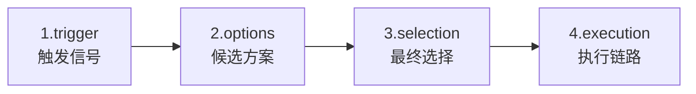

# Agent 监控与决策追踪设计

> 版本：v1.0
> 日期：2026-06-28
> 状态：新增章节，把执行追踪补上决策语义，修复 token 失效等 P0 埋点
> 关联缺口：现有 trace 只追"做了什么"不追"为什么这么做"；Token 统计失效；Memory / RAG / 条件路由未入 trace

## 1. 设计背景

### 1.1 问题陈述

当前系统的链路追踪（[06_可观测与执行追踪设计.md](./06_可观测与执行追踪设计.md)）只回答了"工单经过哪些节点、各耗时多少"，但答辩与论文真正关心的问题，trace 数据**几乎都回答不了**：

| 论文 / 答辩关心的 | trace 能回答吗 | 原因 |
| --- | --- | --- |
| AI 为什么把工单分类为 technical 而不是 billing？ | ❌ | classify span 只存 `{category, priority}`，丢弃 ClassifierAgent 的 `reason` |
| AI 为什么重试 3 次后转人工？ | ❌ | `retry_check` 是 LangGraph 条件边函数，未包 span |
| 这条 trace 烧了多少 token？ | ❌ | `traces.total_tokens` 在 [trace.py:139](../../../src/multi_agent_system/core/trace.py) 初始化为 0 后**无任何位置回写**，永远为 0 |
| RAG 检索是否命中？返回多少条？得分多少？ | ❌ | 知识库检索被通用 `tool_call` span 吞掉 |
| Memory 加载耗时？ | ❌ | `graph.py:193` 的 memory load 在 receive span 内但无独立子 span |
| AI 决策与人工决策的一致率？ | ✅（仅一处） | 仅 `human_decision` span 有结构化决策字段 |

**根本症结**：trace 设计停留在"执行链路"维度，缺少"决策语义"维度。

### 1.2 与同类系统对照

参考另一套 agent 监控后台 admin-web，其核心是把每个决策点结构化为 `trigger → decision → issues`。本设计借鉴这个核心抽象，但**不引入它的生产级特性**（Reflection Agent、数据飞轮、Issue Chain 标注），仅保留毕设需要的最小集合。

| 维度 | 本设计（毕设范围） | admin-web（生产级，不照搬） |
| --- | --- | --- |
| 决策建模 | span.metadata.decision 子结构 | 独立 Reflection 层 |
| 反思评估 | 不做 | trigger→decision→issues 全量评估 |
| 聚合指标 | 仅 trace 内决策列表 + ai_adoption_rate（已实现） | 跨 trace 决策大盘 + Token Dashboard |
| 数据治理 | 不做 | Issue Chain + 人工标注 |

### 1.3 设计目标

把追踪系统从"展示执行过程"补到"能解释 AI 行为"，达到：

1. **决策可解释**：trace 能回答关键分岔路口"AI 怎么选的"，论文有论据
2. **成本可观测**：Token 不再为 0
3. **子调用可见**：Memory / RAG 不被父 span 吞掉

### 1.4 范围边界

| 纳入范围 | 不纳入范围 |
| --- | --- |
| Span metadata 扩展（decision / token_usage / rag_stats） | Reflection 反思 Agent |
| 6 个决策点埋点（classify / route / process / review / retry / human） | 跨 trace 决策聚合大盘 |
| Memory / RAG / 条件路由子 span 埋点 | Token 成本聚合、延迟分布 |
| trace 内决策列表 API + 1 个前端组件 | 数据飞轮 / 人工标注 |

## 2. 决策范式数据模型

### 2.1 决策范式四元组

一次**功能完整的处理决策**必须留下四元组记录：



| 字段 | 类型 | 必填 | 含义 |
| --- | --- | --- | --- |
| `trigger` | object | ✅ | 触发决策的输入信号（如工单内容、评分、retry_count） |
| `options` | array | ✅ | 候选方案列表，每项 `{value, score, reason}` |
| `selection` | object | ✅ | `{value, confidence, reason}` —— 选了什么、置信度、为什么 |
| `execution` | ref | ✅ | 指向后续 span_id（执行链路） |

### 2.2 决策数据挂在 span.metadata.decision

```json
{
  "decision_type": "routing",
  "trigger": {
    "ticket_id": "TK-20260628-001",
    "content_preview": "登录后无法看到订单..."
  },
  "options": [
    {"value": "technical", "score": 0.82, "reason": "包含登录异常关键词"},
    {"value": "billing", "score": 0.15, "reason": "提及订单"},
    {"value": "complaint", "score": 0.03, "reason": "无情绪化表达"}
  ],
  "selection": {
    "value": "technical",
    "confidence": 0.82,
    "reason": "技术问题信号最强"
  },
  "execution": {
    "downstream_node": "process"
  }
}
```

**核心设计**：L2 决策数据作为 `span.metadata.decision` 子结构落库（[SpanORM.metadata_](../../../src/multi_agent_system/models/db.py) 已支持 JSON），**零表结构变更**。

### 2.3 决策点清单

| 节点 | decision_type | trigger 关键字段 | options 来源 | selection 依据 |
| --- | --- | --- | --- | --- |
| `classify` | routing | content / context | ClassifierAgent 输出 | 最高 score 的 category |
| `route` | branching | category / priority / escalate_flag | workflow 路由表（硬编码） | 分支匹配 |
| `process` (ReAct) | tool_selection | thought / observation | ToolRegistry 候选 | LLM 选择 |
| `review` | quality_gate | review_score / threshold | {pass, retry} | 阈值判断 |
| `retry_check` | boundary | retry_count / max_retry | {retry, escalate} | 边界条件 |
| `human_review_wait` | escalation | trigger_type / trigger_reason | {approve, reject, rewrite, reprocess} | 人工决策（已实现） |

前 5 个是本次新增埋点，最后一个在 [09_人工审核工作台设计.md](./09_人工审核工作台设计.md) 已实现。

## 3. P0 埋点修复（让现有 trace 数据真正有用）

### 3.1 LLM Token 回写

**位置**：[core/cached_client.py:169](../../../src/multi_agent_system/core/cached_client.py) 的 `llm_call` span。

```python
# 改造后
async with tracer.start_span("chat_completions", "llm_call", input_data={...}) as span:
    response = await client.chat.completions.create(...)
    span.set_output({"content": response.choices[0].message.content})
    # 新增：回写 token 到 metadata + 触发 trace 累加
    if response.usage:
        span.set_metadata({"token_usage": {
            "prompt_tokens": response.usage.prompt_tokens,
            "completion_tokens": response.usage.completion_tokens,
            "total_tokens": response.usage.total_tokens,
            "model": model_name,
        }})
        await tracer.add_token_usage(trace_id, response.usage.total_tokens)
```

`TraceManager` 新增 `add_token_usage` 方法，SQL：`UPDATE traces SET total_tokens = total_tokens + :delta WHERE trace_id = :trace_id`。

### 3.2 Memory 子 span

**位置**：[workflow/graph.py:193-195](../../../src/multi_agent_system/workflow/graph.py)。

```python
async with tracer.start_span("load_user_context", "memory_call", parent_span_id=...) as mem_span:
    user_context = await _memory_manager.load_user_context(user_id)
    mem_span.set_output({"context_keys": list(user_context.keys())})
```

### 3.3 RAG 子 span

**位置**：[tools/knowledge_search.py](../../../src/multi_agent_system/tools/knowledge_search.py) 入口。

```python
async with tracer.start_span("knowledge_search", "tool_call", input_data={"query": query}) as rag_span:
    hits = await qdrant_client.search(collection, query, limit=top_k)
    rag_span.set_metadata({"rag_stats": {
        "hit_count": len(hits),
        "top_score": hits[0].score if hits else 0.0,
    }})
    rag_span.set_output({"hits": [h.payload for h in hits]})
```

RAG 复用现有 `tool_call` span_type，仅在 metadata 加 `rag_stats`，不新增 span_type。

### 3.4 条件路由决策 span

**位置**：[workflow/graph.py:506](../../../src/multi_agent_system/workflow/graph.py) 附近 `retry_check`。

```python
async def retry_check(state):
    async with tracer.start_span("retry_check", "node", ...) as span:
        retry = state.retry_count
        decision = "retry" if retry < 3 else "escalate"
        span.set_metadata({"decision": {
            "decision_type": "boundary",
            "trigger": {"retry_count": retry, "review_score": state.review_score},
            "options": [
                {"value": "retry", "score": 1.0 if retry < 3 else 0.0, "reason": f"retry={retry}"},
                {"value": "escalate", "score": 1.0 if retry >= 3 else 0.0, "reason": f"retry={retry}"},
            ],
            "selection": {"value": decision, "confidence": 1.0, "reason": "硬阈值"},
        }})
        return decision
```

## 4. 决策埋点（P1）

### 4.1 classify 决策

**位置**：[workflow/graph.py:225](../../../src/multi_agent_system/workflow/graph.py) 附近。

需要 ClassifierAgent 在返回 category/priority 之外，额外返回 `all_options` 与 `confidence`、`reason`（已有，只是被丢弃了）。

```python
async with tracer.start_span("classify", "node", ...) as span:
    result = await classifier_agent.classify(content)
    span.set_output({"category": result.category, "priority": result.priority})
    span.set_metadata({"decision": {
        "decision_type": "routing",
        "trigger": {"content_preview": content[:200]},
        "options": result.all_options,
        "selection": {
            "value": result.category,
            "confidence": result.confidence,
            "reason": result.reason,
        },
        "execution": {"downstream_node": "route"},
    }})
```

### 4.2 review 决策

```python
async with tracer.start_span("review", "node", ...) as span:
    score = await reviewer_agent.review(...)
    span.set_output({"review_score": score})
    verdict = "pass" if score >= 0.7 else "retry"
    span.set_metadata({"decision": {
        "decision_type": "quality_gate",
        "trigger": {"review_score": score, "threshold": 0.7},
        "options": [
            {"value": "pass", "score": score, "reason": "score >= 0.7"},
            {"value": "retry", "score": 1 - score, "reason": "score < 0.7"},
        ],
        "selection": {"value": verdict, "confidence": abs(score - 0.7) / 0.3, "reason": "阈值判断"},
    }})
```

### 4.3 埋点清单

| 改造点 | 文件 | 优先级 | 工时 |
| --- | --- | --- | --- |
| LLM token 回写 | `core/cached_client.py` + `core/trace.py` | P0 | 0.5 天 |
| Memory 子 span | `workflow/graph.py` | P0 | 0.5 天 |
| RAG 子 span | `tools/knowledge_search.py` | P0 | 0.5 天 |
| retry_check 决策 | `workflow/graph.py` | P0 | 0.5 天 |
| classify 决策 | `workflow/graph.py` + `agents/classifier.py` | P1 | 1 天 |
| review 决策 | `workflow/graph.py` + `agents/reviewer.py` | P1 | 0.5 天 |
| 前端 DecisionTimeline 组件 | `web/src/components/trace/` | P1 | 1 天 |
| **合计** | | | **约 4.5 天** |

## 5. API 与前端

### 5.1 API 改动

只新增 1 个端点，其他靠现有 `/trace` 接口的 metadata 字段透传：

| 方法 | 路径 | 用途 |
| --- | --- | --- |
| GET | `/api/tickets/{id}/trace` | 现有，**响应不变**：spans.metadata 已包含 decision 子结构 |
| GET | `/api/traces/{trace_id}/decisions` | **新增**：列出该 trace 的所有决策点（从 spans.metadata.decision 提取） |

#### GET `/api/traces/{trace_id}/decisions`

```json
{
  "trace_id": "tr-...",
  "ticket_id": "TK-...",
  "decision_count": 3,
  "decisions": [
    {
      "span_id": "sp-...",
      "span_name": "classify",
      "decision_type": "routing",
      "selection_value": "technical",
      "confidence": 0.82,
      "options_count": 3,
      "timestamp": "2026-06-28T10:00:01"
    }
  ]
}
```

### 5.2 前端改动

**新增 1 个组件**：`web/src/components/trace/DecisionTimeline.tsx`

| 组件 | 职责 |
| --- | --- |
| `DecisionTimeline` | 嵌入工单详情页右侧，垂直展示该 trace 的所有决策点；每项含决策类型徽章、候选数、置信度条、最终选择值 |

视觉规范：
- 决策类型徽章颜色：routing 蓝、branching 紫、quality_gate 青、boundary 橙、tool_selection 灰、escalation 红
- 置信度色阶：< 0.5 红、[0.5, 0.7) 橙、[0.7, 0.9) 黄、>= 0.9 绿

现有 [SpanDetailSheet](../../../web/src/components/trace/) 不动，metadata 字段会自动渲染新增的 decision / token_usage / rag_stats。

## 6. 与现有文档的同步

| 文档 | 更新要点 |
| --- | --- |
| [06_可观测与执行追踪设计.md](./06_可观测与执行追踪设计.md) | span_type 列表新增 `memory_call`；说明 decision 数据走 metadata 子结构 |
| [03_接口协议/01_HTTP_API接口协议.md](../03_接口协议/01_HTTP_API接口协议.md) | 新增 `/traces/{id}/decisions` 端点 |
| [03_接口协议/03_Agent内部数据契约.md](../03_接口协议/03_Agent内部数据契约.md) | ClassifierAgent / ReviewerAgent 返回值补 all_options / confidence / reason |
| [07_前端页面与交互设计.md](./07_前端页面与交互设计.md) | 新增 DecisionTimeline 组件说明 |

## 7. 测试策略

| 测试类 | 覆盖点 |
| --- | --- |
| Span metadata 序列化 | decision / token_usage / rag_stats 子结构正确写入与读取 |
| Token 累加 | llm_call span 完成后 traces.total_tokens 正确累加 |
| 决策埋点单测 | classify / review / retry_check 节点产出完整四元组 |
| API 集成测试 | `/traces/{id}/decisions` 契约一致性 |
| 前端组件测试 | DecisionTimeline 渲染与置信度色阶 |

## 8. 实施优先级

| 阶段 | 任务 | 工时 |
| --- | --- | --- |
| **P0** | LLM token 回写 + Memory / RAG / retry_check 子 span 埋点 | 2 天 |
| **P1** | classify / review 决策埋点 | 1.5 天 |
| **P1** | `/traces/{id}/decisions` API + DecisionTimeline 组件 | 1 天 |
| **合计** | | **约 4.5 天** |

## 9. 论文价值

- **可解释性**：每个分岔路口都有结构化的决策记录，论文"系统可解释性"章节有具体素材
- **数据支撑**：Token / Memory / RAG 指标可用于"系统性能分析"章节，不再是空字段
- **答辩演示**：现场点开 classify 决策 → 展示 3 个候选 + 置信度 + 选择理由，比单纯展示节点树更有说服力
