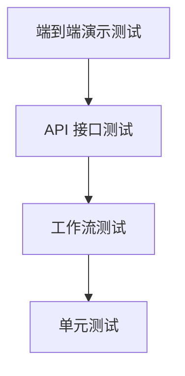

# 测试策略

## 1. 测试目标

测试目标是验证智能工单系统的核心闭环能够稳定运行，并确保多 Agent 工作流、API 接口、数据存储和前端依赖的数据结构保持一致。

## 2. 测试分层

| 层级 | 测试内容 |
| --- | --- |
| 单元测试 | 工具函数、缓存、重试、数据库、模型路由 |
| 工作流测试 | 意图理解、分类路由、处理、审核、重试、人工审核挂起与恢复 |
| API 测试 | 鉴权、工单 CRUD、知识库、统计、trace、reviews |
| 端到端演示 | 前端提交工单并观察实时状态 |

## 3. 工作流测试重点

工作流是系统核心，应重点覆盖：

- 投诉类工单进入升级处理。
- P0 工单进入升级处理。
- 技术和账务工单进入处理与审核。
- 审核通过后完成。
- 审核失败后重试。
- 超过重试上限后进入人工审核。
- 审核员提交决策后按 approve/rewrite/reprocess/reject 恢复流程。

## 4. Agent 测试重点

Agent 测试不应强依赖真实 LLM 服务，可以通过 mock 或占位逻辑测试：

- 分类 Agent 返回合法分类和优先级。
- 意图 Agent 能从自然语言中提取结构化字段。
- LLM 调用失败时分类降级可用。
- 处理 Agent 返回非空处理结果。
- 审核 Agent 返回 0 到 1 之间的评分。
- 协调 Agent 能处理升级和失败场景。

## 5. API 测试重点

- 创建工单接口返回 `ticket_id`。
- 未登录访问业务接口返回 401，登录后可访问。
- 查询不存在工单返回 404。
- 列表接口支持分页和过滤。
- 知识库上传缺少标题或正文时返回 400。
- 统计接口返回基础统计字段。
- trace 不存在时返回 404。
- reviews 队列、详情、决策和统计接口符合契约。

## 6. 演示测试

答辩或验收前建议准备以下演示数据：

- 技术类：“无法登录系统，点击登录按钮后报错 500。”
- 账务类：“我的账单重复扣费，请帮我核实。”
- 投诉类：“我要投诉，上次问题一直没有解决。”
- P0 类：“后台核心业务完全不可用，全部用户无法访问。”

通过这些样例可以覆盖主要路由路径。
