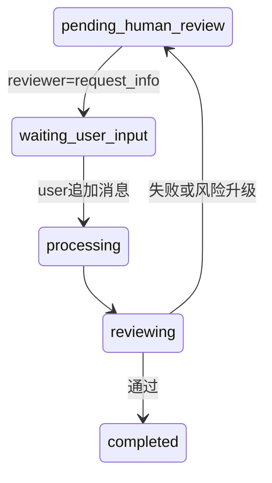

# 多轮工单补充信息流程设计

## 背景

当前系统已经支持 AI 处理失败或高风险工单转入人工审核，并通过人工决策恢复工作流。但人工审核只能做通过、驳回、改写、重处理，缺少“请用户补充信息后继续处理”的真实客服闭环。

目标是支持以下流程：

1. 用户提交工单。
2. AI 处理后转入人工审核。
3. 审核员发现缺少订单号等关键信息，请用户补充。
4. 用户在同一工单详情页追加回复。
5. 系统带上原始工单和补充消息继续处理。
6. 如仍缺信息，可再次进入补充循环。

## 推荐方案

采用“工单详情页对话/留言流”方案，而不是一次性补充表单。每个工单拥有一组消息，参与者包括用户、审核员、系统和 Agent。工单状态机新增等待用户补充状态，人工审核新增请求补充决策。

## 状态模型

新增工单状态：

- `waiting_user_input`：工单暂停，等待用户补充信息。

核心流转：



状态含义：

- `pending_human_review`：等待审核员动作。
- `waiting_user_input`：审核员已请求补充，等待用户回复。
- `processing`：用户已补充，系统继续处理。

## 数据模型

新增表 `ticket_messages`：

| 字段 | 类型 | 说明 |
| --- | --- | --- |
| `message_id` | string PK | 消息 ID |
| `ticket_id` | string | 所属工单 |
| `sender_type` | string | `user` / `reviewer` / `system` / `agent` |
| `sender_id` | string nullable | 用户或审核员标识 |
| `content` | text | 消息内容 |
| `metadata_json` | text nullable | 扩展数据 |
| `created_at` | datetime | 创建时间 |

索引：

- `idx_tm_ticket_created(ticket_id, created_at)`
- `idx_tm_sender(sender_type)`

`human_reviews.decision` 新增枚举值：

- `request_info`：请求用户补充信息。

## 后端接口

### 获取工单消息

`GET /tickets/{ticket_id}/messages`

返回该工单的消息流，按时间升序排列。工单详情页加载时调用。

### 用户追加消息

`POST /tickets/{ticket_id}/messages`

请求体：

```json
{
  "content": "订单号是 123456",
  "sender_id": "user-001"
}
```

规则：

- 工单处于 `waiting_user_input` 时，用户消息会触发恢复处理。
- 工单处于 `completed` 或 `failed` 时，拒绝追加消息，返回 409。
- 其他运行中状态暂不开放用户追加消息，避免并发修改正在执行的工作流。
- 恢复处理时将状态改为 `processing`，后台运行工作流。

### 人工请求补充

复用现有接口：

`POST /reviews/{ticket_id}/decision`

请求体扩展：

```json
{
  "decision": "request_info",
  "decision_reason": "缺少订单号，无法查询支付记录",
  "reviewer_id": "reviewer-001"
}
```

行为：

- 当前 `human_reviews` 行标记为 `decided`。
- 写入一条 `reviewer` 消息，内容使用 `decision_reason`。
- 工单状态改为 `waiting_user_input`。
- 广播 `user_input_requested` 事件。
- 不立即恢复 LangGraph。

## 工作流恢复

新增恢复入口：用户补充后从 `process` 节点继续执行。

恢复 state 构造规则：

- `content` 使用原始工单内容。
- 附加 `conversation_context`，包含最近若干条 `ticket_messages`。
- `processing_result` 清空。
- `review_score` 清空。
- `retry_count` 重置为 0，避免补充后被旧失败次数影响。

ProcessorAgent 输入应包含：

```text
原始工单：
...

补充信息记录：
[reviewer] 请补充订单号
[user] 订单号是 123456
```

## 前端交互

### 工单详情页

新增“沟通记录”区域：

- 展示系统、AI、审核员、用户消息。
- 当状态为 `waiting_user_input` 时，显示输入框和提交按钮。
- 提交成功后显示“已提交补充信息，系统正在继续处理”。

### 人工审核工作台

决策面板新增按钮：

- `请求补充`

选择后：

- 决策理由输入框文案变为“请输入希望用户补充的信息”。
- 提交后当前工单离开审核队列。

### 状态展示

状态标签新增：

- `waiting_user_input` 显示为“待用户补充”。

## WebSocket 事件

新增事件：

- `user_input_requested`
- `ticket_message_created`
- `workflow_resumed_from_user_input`

详情页订阅当前工单 WebSocket，收到消息后刷新工单详情和消息列表。

## 错误处理

- 非待补充状态下用户提交补充信息：返回 409，不保存消息。
- 工单不存在：返回 404。
- 用户提交空内容：返回 422。
- 恢复工作流失败：工单转入 `pending_human_review`，触发 `error_fallback` 审核记录。
- 重复提交：消息允许多条，但同一请求不做幂等去重，前端通过按钮 loading 防止连点。

## 测试计划

后端测试：

- `request_info` 决策会把工单改为 `waiting_user_input`。
- `request_info` 会写入 reviewer 消息。
- 用户在 `waiting_user_input` 下追加消息会触发恢复处理。
- ProcessorAgent 能看到原始工单和补充消息。
- 普通工单消息列表按时间升序返回。

前端测试：

- 工单详情在 `waiting_user_input` 状态展示补充输入框。
- 提交补充后刷新状态和消息流。
- 审核工作台出现“请求补充”决策。
- 状态标签正确显示“待用户补充”。

集成验证：

- 新建缺少订单号的工单。
- 转入人工审核。
- 审核员请求补充订单号。
- 用户补充订单号。
- 系统继续处理并生成最终结果。

## 非目标

本次不实现：

- 附件上传。
- 多审核员会签。
- 消息已读回执。
- SLA 超时提醒。
- 真实用户账户权限隔离。
